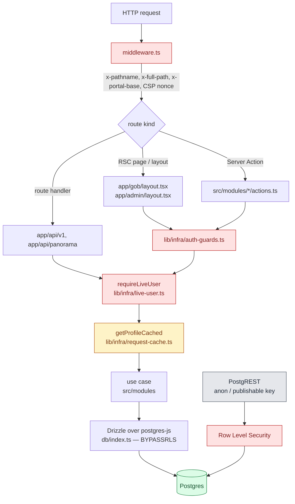
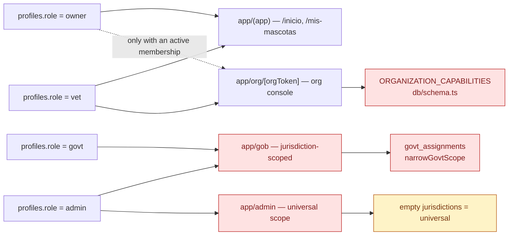

# Authorization — the boundary chain

> Snapshot: `c10f4ff03` (`main`) · Facts: `docs/architecture/facts.json` generated 2026-09-02
> Verified against code on 2026-09-02 by writer C (opus subagent) · Status: reviewed
> Numbers in this file are `<!-- fact:key -->` markers checked by `__tests__/architecture-facts.test.ts`.

## What this document answers

Who may do what, where that is decided, and what happens when a gate is missing.
It describes five layers — middleware, portal layout, boundary guard, use case,
RLS — and states for each one what it does enforce and what it cannot.

It is a reference for the code as it stands, not a claim that the code is
correct. The 2026-09 audit filed open findings against three of these layers;
they are named inline and collected in [Known gaps](#known-gaps).

## The chain, in one picture



The two paths into Postgres are the point. The application path
(`db/index.ts`) connects as a role with `BYPASSRLS`, so for anything the app
does, the guard chain **is** the authorization; RLS is inert there. The
PostgREST path carries the caller's own JWT and is governed by RLS alone, with
no guard chain in front of it at all. A property enforced only in the first
column is not enforced for a client that talks to Supabase directly.

## Layer 1 — middleware

`middleware.ts` runs on every non-static request (`middleware.ts:256` declares
the matcher). It does four things and **authorizes nothing**:

| What | Where | Note |
|---|---|---|
| Refresh the Supabase auth cookies | `middleware.ts:216` → `lib/supabase/middleware.ts` | Session freshness, not a check |
| Stamp `x-pathname` and `x-full-path` | `middleware.ts:131`, `middleware.ts:140` | The guards read `x-full-path` back to build a post-login `returnTo` |
| Stamp `x-portal-base` | `middleware.ts:169` | `/admin` vs `/gob` chrome for shared work surfaces |
| Per-request CSP nonce + legacy 308 redirects | `middleware.ts:114` onward | Enforcing CSP since a headless violation sweep came back clean |

There is no role read, no profile read, and no deactivation read in the
middleware. Everything that decides authority happens after it.

## Layer 2 — `requireLiveUser`, the one liveness guard

`lib/infra/live-user.ts:262`. Result-shaped (it returns a refusal, it does not
throw or redirect), so both a page guard and a route handler can translate the
same answer into their own idiom.

Five refusals, in a documented precedence (`lib/infra/live-user.ts:76` declares
the union; the ordering rationale is at `:245-261`):

| Order | Reason | Predicate | Line |
|---|---|---|---|
| 1 | `MAINTENANCE` | env kill-switch, evaluated before any client or query | `lib/infra/live-user.ts:263` |
| 2 | `NO_SESSION` | `supabase.auth.getUser(accessToken)` returned no user | `lib/infra/live-user.ts:292` |
| 3 | `ACCOUNT_ERASED` | `profile?.deletedAt != null` | `lib/infra/live-user.ts:309` |
| 4 | `DEACTIVATED` | `deactivatedAt != null` — **any** account type (institutional deactivation by an operator, or a personal self-deactivation from /cuenta) | `lib/infra/live-user.ts` |
| 5 | `SHIFT_EXPIRED` | institutional principal outside its shift window | `lib/infra/live-user.ts:342` |

Three properties are worth stating exactly, because each has bitten:

**Authority is DB-resolved, not claim-resolved.** The token answers *who*
(`getUser` has GoTrue validate it); `getProfileCached`
(`lib/infra/request-cache.ts`) answers *whether they may still act*. The one
value read from the credential is when the session was authenticated, for the
shift window — `lib/infra/operator-shift.ts` carries that argument. This is what
makes the bearer path (`lib/supabase/bearer.ts`, used by `app/api/v1`) resolve
through the same guard as the cookie path rather than a parallel one.

**Erased outranks deactivated.** An erased account has no identity left to be
merely deactivated. `SHIFT_EXPIRED` is deliberately last: it is the only
recoverable refusal, and telling an erased operator "your shift ended" invites
an infinite retry.

**Deactivation is institutional-only, on purpose and with a cost.** The
predicate at `lib/infra/live-user.ts:324` reads `accountType`, so
`profiles.deactivated_at` on a PERSONAL account is a column nothing reads for
access. The code says so in its own comment (`:319-323`). The audit filed this
as `A01-1` (HIGH) — see `dim-interno:docs/reviews/2026-09-fresh/lenses/A01.md`. The fix is
gated on a landing screen that does not exist yet, because widening the
predicate without one reproduces the 2026-07-04 redirect loop the
`role-landing.ts` header documents.

### Erased and deactivated, in two spellings

Two modules answer the same two questions with different operators:

- `lib/infra/live-user.ts:309` uses loose `!= null` — byte-for-byte the
  predicate the guards it absorbed already used.
- `lib/infra/role-landing.ts:80` (`isErasedAccount`) and
  `lib/infra/role-landing.ts:58` (`isDeactivatedInstitutional`) use strict
  `!== null`, which treats a profile shape that simply omits the column as
  erased.

Production never sees the difference because `getProfileCached` always selects
both columns. The invariant is held by a comment, not by a test; A01's Nits
section proposes the one-line assertion that would hold it.

`resolveOptionalLiveUser` (`lib/infra/live-user.ts:216`) is the same guard for
the three write boundaries where an anonymous caller is legitimate (the
anonymous denuncia and the two adoption-application actions). `NO_SESSION`
becomes `user: null`; erasure, deactivation and maintenance stay refusals — an
erased subject's submission is refused rather than laundered into an
apparently-anonymous one.

## Layer 3 — the boundary guards

`lib/infra/auth-guards.ts` translates a refusal into what a page, a layout or an
org surface needs. It is a thin wrapper over `requireLiveUser`, not a parallel
implementation.

| Guard | Line | Establishes |
|---|---|---|
| `requireUserOrRedirect` | `lib/infra/auth-guards.ts:79` | A session. Redirects on four refusals and **tolerates `DEACTIVATED`** |
| `requireOrgAccessByToken` | `lib/infra/auth-guards.ts:115` | Active membership in the org named by the URL token; `notFound()` on failure so "not a member" and "no such org" are indistinguishable |
| `loadActiveInstitutionalProfile` | `lib/infra/auth-guards.ts:177` | role ∈ allow, `accountType === 'institutional'`, `deactivatedAt === null` |
| `requireAdminOrGovtOrRedirect` | `lib/infra/auth-guards.ts:190` | admin or govt + the caller's active `govt_assignments` |
| `requireAdminOrRedirect` | `lib/infra/auth-guards.ts:227` | admin only |
| `requireDecomisoPrincipal` | `lib/infra/auth-guards.ts:275` | Ley 14.346 seizure authority — profile-level, never an org grant |
| `requireDenunciaModerationPrincipal` | `lib/infra/auth-guards.ts:307` | denuncia moderation authority, jurisdiction-scoped by the caller |

The deliberate asymmetry at `lib/infra/auth-guards.ts:79`: a deactivated
institutional account keeps READ access to `/cuenta` so it can see why and log
out, while the operator portals reject it in `loadActiveInstitutionalProfile`
(`:185-186`) and every write refuses it through `requireLiveUser`. Bouncing it
off everything is exactly how the 2026-07-04 `ERR_TOO_MANY_REDIRECTS` incident
happened.

Two named guards (`requireDecomisoPrincipal`, `requireDenunciaModerationPrincipal`)
delegate verbatim to `requireAdminOrGovtOrRedirect`. They exist so the call site
reads as the authority it needs. Both carry the same warning in their header:
**jurisdiction scope is the caller's responsibility**, not the guard's.

The API surface has its own translation of the same chain.
`app/api/panorama/_guard.ts:71` (`resolveInstitutionalPanoramaActor`) runs
`requireLiveUser`, then role and `accountType`, then a per-operator rate limit,
and answers with a status code instead of a redirect. All five
`app/api/panorama` data routes call it.

## Layer 4 — roles × account types

Two columns carry the answer, and **nothing in Postgres pairs them**. Migration
`db/migrations/0015_admin_page_closure.sql` added a
`profiles_account_type_role_match` CHECK; `db/migrations/0016_drop_role_match_check.sql`
dropped it in favour of app-layer enforcement. A `govt` row that says
`personal`, or an `institutional` row still carrying `owner`, is a shape the
database permits.

`isInstitutionalPrincipal` (`lib/infra/live-user.ts`) is the predicate that
survives that looseness. It is an **OR**, not an AND:

```
accountType === "institutional" || role === "govt" || role === "admin" || role === "national"
```

`national` (migration 0214) is included: the SQL twin of this predicate,
`public.caller_meets_institutional_aal()` (migration 0231), tests
`account_type = 'institutional' OR role IN ('admin', 'govt', 'national')`, and the
second-factor gate (`src/modules/auth/application/mfa/mfa-session.ts`) uses this
predicate — the two must name the same set.

Requiring both would let a single mismatched column silently opt an operator out
of the shift boundary. It is exported because the org capability path
(`src/modules/organizations/infrastructure/authz-resolver.ts`) has to apply the
same policy to a principal this file cannot see: org staff commonly hold a
PERSONAL profile while operating an org console.

`db/schema.ts:60` declares the role enum: `owner`, `vet`, `govt`, `admin`.
`db/schema.ts:182` declares the org membership role enum, which is a different
axis entirely — a person's platform role and their role inside one organization
are independent.



### Roles × portals, as a matrix

| Portal | owner | vet | govt | admin | Gate |
|---|:--:|:--:|:--:|:--:|---|
| `app/(app)` — citizen surfaces | yes | yes | yes | yes | `requireUserOrRedirect` |
| `app/org/[orgToken]` — org console | with membership | with membership | with membership | with membership | `requireOrgAccessByToken` + capability |
| `app/gob` | no | no | scoped | universal | `requireAdminOrGovtOrRedirect` (`app/gob/layout.tsx:58`) |
| `app/admin` | no | no | no | yes | `requireAdminOrRedirect` |
| `app/api/panorama` | no | no | scoped | universal | `resolveInstitutionalPanoramaActor` |
| `app/libreta/compartir` — share link | anonymous holder of the token | — | — | — | capability token, no session |

"With membership" is not a role check: the org console is reached through the
URL's org token, and the membership is resolved from that token, never from
session state.

## Layer 4b — organization capabilities

`db/schema.ts:206` declares `ORGANIZATION_CAPABILITIES` —
<!-- fact:org_capabilities -->16<!-- /fact --> strings, kept as TEXT rather than
a pgEnum so adding one is a one-line edit rather than a migration.

The UI catalog is a **subset**. `src/modules/organizations/domain/capabilities.ts:32`
declares `CAPABILITY_CATALOG` with Spanish label and description per entry, and
it omits `org.transfer.propose` and `org.transfer.accept` — the two cross-org
transfer capabilities that `COORDINATOR_IMPLICIT_CAPS`
(`src/modules/organizations/domain/capabilities.ts:190`) grants implicitly to
coordinators. So those two are grantable and enforceable but have no row in the
permissions table a member sees. That is a UI gap, not an authorization gap;
`isValidCapability` (`:132`) validates against the schema constant, not the
catalog.

Resolution is pure (`resolveGrantedCaps`, `:209`):

- membership role `admin` → every capability, no explicit grant needed;
- `vet_individual` → `VET_INDIVIDUAL_IMPLICIT_CAPS` (`:182`) ∪ approved grants;
- `coordinator` → `COORDINATOR_IMPLICIT_CAPS` ∪ approved grants;
- everyone else → approved grants only.

`SHELTER_ONLY_CAPABILITIES` (`:147`) is an org-TYPE filter layered on top: a
clinic never surfaces the six custody-rehoming capabilities even when its
membership admin implicitly holds them.

One capability is deliberately NOT in the org set:
`WELFARE_DECOMISO_EXECUTE_CAPABILITY` (`:123`). A decomiso is an act of the
State under Ley 14.346, so it is a profile-level role check
(`requireDecomisoPrincipal`) and never something an org membership can confer —
`lib/infra/auth-guards.ts:256-264` records the reasoning.

The confused-deputy class here is closed and fenced: every `/org/{orgToken}`
action pins its capability check to the URL-resolved org via
`requireCapabilityForOrgToken`, and `scripts/check-confused-deputy.ts`
(`lint:authz-orgtoken`, inside `pnpm verify`) fails the build if one reverts to
the bare form. Its allowlist is empty. All fifteen prior findings in this class
are closed (`dim-interno:docs/reviews/2026-09-fresh/lenses/A10.md`, priors 21-7 through
21-15).

## Layer 4c — jurisdiction scope

A govt operator's authority is a set of `(province, locality)` pairs from
`govt_assignments`, resolved once per request by
`requireAdminOrGovtOrRedirect`. Admin gets an **empty** list, which means
universal.

That convention — empty means universal — is the sharp edge, because a govt
operator can also legitimately end up with an empty list after narrowing. The
predicates that convert a scope to SQL therefore fail closed:

| Helper | Path | Empty-list behaviour |
|---|---|---|
| `jurisdictionPairClause` | `lib/metrics/scope.ts:44` | returns `null` (`:49`) — caller decides |
| `petsScopeClause` | `lib/metrics/scope.ts:94` | returns a SQL `false` literal (`:109`) |
| `jurisdictionScopeContains` | `lib/domain/jurisdiction-canonical.ts:191` | false for an empty list |
| `narrowGovtScope` | `lib/domain/jurisdiction-canonical.ts:226` | narrows only; cannot widen |
| `resolveScopedJurisdictions` | `lib/infra/gov-scope.ts:65` | admin unchanged; govt delegates to `narrowGovtScope` |

`lib/infra/gov-scope.ts:42-63` carries the argument for why
`resolveScopedJurisdictions` delegates rather than filtering inline: an exact-pair
filter erased a WHOLE-PROVINCE assignment the moment a locality was picked (that
row's locality is the empty-string sentinel, never a barrio name), the scope
compiled to a SQL `false` literal, and a provincial operator's own dashboard came
back empty. It failed closed, so it was not a leak — it was the central feature
breaking for exactly the class of official being onboarded.

Two fences watch this layer:

- `scripts/check-scope-discipline.ts` — a raw `jurisdictionProvince` /
  `jurisdictionLocality` predicate anywhere under `lib/analytics` outside
  `lib/analytics/dashboards/_scope.ts` is flagged. Existing occurrences are
  baselined (`scripts/scope-discipline-baseline.json`); new ones fail.
- `scripts/check-scope-authz.ts` — coherence, not discipline: every table the
  scope layer narrows in SQL must also have RLS enabled in the database. Its
  header records the failure it exists for — staging ran for weeks with RLS off
  on twenty-seven tables and no screen noticed, because nothing ever compared
  what the app narrows against what the database would hand a direct client.

`scripts/check-authz-scoping.ts` is a third, weaker instrument: a ratchet that
fails on per-file growth and, since 2026-09-18 (A01-8), on the SUM — a live total
below the baseline total is red until the baseline is re-recorded, so a burned-down
offender's slot cannot carry over into a later commit. It counts, it does not track
which exports offend: a fix and a new offender in the same file in one commit net to
zero, and nothing but review stops a commit from raising the baseline JSON. The
recorded total only goes down across commits while every diff to
`scripts/authz-scoping-baseline.json` is reviewed. It still proves nothing about the
offenders it tolerates; the burn-down belongs to the pilot loop.

## Layer 5 — the authz fence, and what it accepts

`scripts/check-authz-guards.ts` (`lint:authz`, inside `pnpm verify`) is the
coverage rule: every exported `async function` in a `"use server"` module, and
every exported route handler, must either call a recognised guard, be an inner
writer, or carry a written `// @no-auth-required: <reason>`.

Discovery is by CONTENT, not filename: any module under `app/`, `src/` or
`lib/` whose first statement is `"use server"` (`ACTION_SOURCE_GLOBS` in
`scripts/check-authz-guards.ts`; the old filename globs survive as a union
floor, `LEGACY_ACTION_GLOBS`). `lib/` joined on 2026-09-18 (A01-7). Route handlers are discovered separately on purpose — four
other fences import `listActionFiles`, and a fence must not move another fence's
boundary as a side effect.

The recognised lists:

| List | Line | What it establishes |
|---|---|---|
| `AUTH_GUARDS` | `scripts/check-authz-guards.ts:50` | A session resolved |
| `INSTITUTIONAL_GUARDS` | `:113` | admin/govt authority, for `app/admin` and `app/gob` |
| `SYSTEM_GUARDS` | `:149` | `authorizeCronRequest` / `checkCronSecret` |
| `PERSONAL_TIER_GUARDS` | `:155` | Personal-tier only — an operator route gated by these alone is an offender |
| `DELETION_AWARE_GUARDS` | `:187` | Guards that read `deleted_at`; a bare `auth.getUser` plus a write to ANY table without one of these is an offender |
| `ROUTE_HANDLER_GUARDS` | `:631` | The union of the three above |

**What it accepts that it arguably should not** — stated because a fence's
tolerances are part of its contract:

Closed on 2026-09-18: bare `"auth.getUser"` is no longer an `AUTH_GUARDS`
entry, and `findDeletionUnawareMutations` fires on a write to any table, not
only `pets`/`petEvents` (A01-3); `lib/**` is scanned (A01-7). Neither had a live
offender. Since 2026-09-22 a "write" is `.insert(` / `.update(` / `.delete(` /
`.upsert(`, a `sql` template starting with `insert into`, `update` or
`delete from`, or `.rpc(`; a write behind a helper call, a SQL string built
outside a `sql` template, or a CTE is still invisible to it.

1. The route-handler rule reads the HANDLER BODY only and does not follow calls,
   so a guard factored into a module-level helper reads as absent. That is
   deliberate and the error message says so.

It also does one thing worth copying: `:575` fails when a module *defines* a
local with a recognised guard's name. A local `requireUser()` that guards
nothing makes every caller read as guarded, which happened once in
`app/actions/notifications.ts`.

## Layer 6 — RLS as backstop

The full inventory is `docs/architecture/rls-coverage.md`. The short version:

- <!-- fact:rls_enabled_tables -->60<!-- /fact --> distinct tables are DECLARED
  with `ENABLE ROW LEVEL SECURITY` across `db/migrations` and the `db/*.sql`
  snapshots. That is a count of declarations, not a live catalog reading — the
  live authority is `__tests__/rls` against `pg_class.relrowsecurity`.
- <!-- fact:security_definer_functions -->12<!-- /fact --> functions are declared
  `SECURITY DEFINER`. Each one is a deliberate privilege escalation with its
  caller check inside its own body.
- RLS governs the PostgREST surface only. It never affects the action edge,
  because `db/index.ts` connects as a `BYPASSRLS` role.

**The 2026-09 audit's only CRITICAL lived exactly in the seam between those two
sentences.** `"Profiles updatable by self"` pinned the ROW (`id = auth.uid()` in
both `USING` and `WITH CHECK`) and never a COLUMN, so any authenticated account
could `PATCH` its own `profiles.role` to `admin` over PostgREST — and the
authorization layer above reads exactly that column. Closed by
`db/migrations/0211_profiles_lock_postgrest_writes.sql`, which **drops** the
policy rather than narrowing it, mirroring what
`db/migrations/0163_ownerships_lock_postgrest_writes.sql` did to `ownerships`.
Fence: `__tests__/rls/profiles-write-lockdown.test.ts`. Applied to the staging
project on 2026-09-02; there is no production database.

A column `REVOKE` was NOT the fix, and the reason is structural: `applySchemaGrants`
in `scripts/deploy-provision.ts` re-grants `ALL` to `authenticated` on every
provision, so a `REVOKE` is undone by the next deploy.

`db/migrations/0190_titular_only_rls.sql` still carries the same shape on
`pet_events`: its INSERT policy constrains ownership and the titular-only event
list, and constrains neither `author_role` nor `author_verified`. That is
`A02-1` (HIGH), decided and queued as the next free migration number — see
`dim-interno:docs/reviews/2026-09-fresh/lenses/A02.md` and
`dim-interno:docs/reviews/2026-09-fresh/BACKLOG.md`. Recount the migration number at write
time; do not hardcode one from a plan.

## Service-role call sites

<!-- fact:service_role_call_sites -->46<!-- /fact --> call sites invoke the
service-role client factory across `app/`, `src/`, `lib/` and `scripts/`.
**Every one of them bypasses RLS by design.** The factory itself lives in
`lib/supabase/admin.ts` and is excluded from the count.

They fall into four classes, and each class exists for a different reason:

| Class | Why service role | Example |
|---|---|---|
| Signed-URL minting for private buckets | An authenticated-role SELECT on a private bucket is an enumeration grant, not an access check | `lib/infra/storage.ts` — the module header states this |
| GoTrue admin operations | `auth.admin.getUserById`, `deleteUser` — no caller-role equivalent | subject-rights erasure, `/admin` and `/gob` operator screens |
| Anonymous surfaces that must read one gated field | The caller has no session at all | the finder page's owner-email read, double-gated on pet status and per-field consent |
| Upload tickets | A signed upload URL does not consult RLS at all | `lib/infra/pet-photo-upload.ts` against the `uploads-staging` bucket |

The discipline that keeps this honest is per-call-site justification, not a
count. A service-role read with no in-query scope predicate is authorized by the
caller and by nothing else — which is why `sign-timeline-attachments.ts` filters
on `attachments.petId` as well as the caller-supplied event ids, and why its
docblock says the in-query fence is the ONLY authorization.

## Known gaps

Open at this snapshot. Each is a filed finding; severity and full reproduction
live in the lens.

| id | Severity | Where | One line |
|---|---|---|---|
| `A01-1` | HIGH | `lib/infra/live-user.ts:324` | A self-deactivated PERSONAL account is never locked out at any boundary |
| `A02-1` | HIGH | `db/migrations/0190_titular_only_rls.sql` | `pet_events` PostgREST INSERT admits forged `author_role` / `author_verified` |
| `A01-4` | MED | `app/actions/localities.ts` | Test-only rate-limit resets are exported from `"use server"` modules |
| `A10-2` | MED | `src/modules/organizations/application/admin-proposals/propose-vet-upgrade.ts` | A govt proposal writes a client-supplied jurisdiction with no assignment check |
| `A01-5` | LOW | `lib/`, `src/modules/pets/application/` | Readers that still take a bare subject id, so the caller is the only fence — listed below |

`A01-3` (MED) and `A01-7` (LOW) left this table on 2026-09-18 — see Layer 5.
`A01-8` (LOW) left it the same day: the scoping ratchet fails on the sum (Layer 4c).
`A01-6` (LOW) closed with them: `searchUsers` has no default scope, so a caller
that omits it is a compile error instead of a universal PII search. `A01-5` was
narrowed rather than closed: `fetchPetWeightHistory` and
`fetchPetEventsForProfileV2` take the viewer and carry `viewerHoldsPetClause`
(`lib/infra/pet-holder-clause.ts`, the SQL statement of
`resolvePetHolderAccess`), and the dead `fetchVaccinationHistory` is gone.
The libreta's timeline and vaccination-source queries in
`src/modules/pets/application/tab-data/get-libreta-face-data.ts` carry the same
clause, found by the fresh-context security review of 2026-09-22.

What `A01-5` still covers — every one of these is reached today only after
`requirePetAccess` / `resolvePetHolderAccess` (or the caller's own ownership
bound), and none of them repeats the check in its query:

- `lib/analytics/owner-dashboard.ts`
  - `fetchVaccinationSummariesForPets(petSpecies)` — reads `pet_events` by the
    caller's pet ids and takes no viewer at all.
  - `fetchComplianceStatesForPets(userId, petIds)` — only the microchip read is
    narrowed to the viewer's live ownerships. The `pet_events`, `pets` and
    `appointments` reads use the caller's `petIds` as given; the `reminders`
    read also filters `reminders.user_id = userId`.
- `getLibretaFaceData` (`get-libreta-face-data.ts`), still by bare `pet.id`: the
  medication-reminders read, the upcoming-appointments read,
  `fetchActiveIdentifications(pet.id)`, the active `libreta_share_tokens` read
  and the current-owner `ownerships` read.
- `loadOwnerPetDetail` (`load-owner-pet-detail.ts`), through its ports, by bare
  `pet.id`: `readLostData`, `loadIdentifications` (`fetchActiveIdentifications`),
  `readReservedRabiesTurno`, `loadCaretakerState`, `loadRehomeState`,
  `readServiceDog` and `readCases`; `readPhoto` takes `pet.primaryPhotoId`.
- The readers the lens folded in and this pass did not touch: the case detail
  behind `getCaseDetailByPublicCode`, `lib/analytics/dashboards/welfare.ts`,
  and `createNotification` (writes to any `input.userId`).

`A01-2` (MED, `fetchQueueHealthScoped([])` returning national approval-queue
counts for a govt narrowed out of its mandate) left this table on 2026-09-09:
the fetcher now takes the page's `ProjectionContext` and reads the scope off
`ctx.scope.kind`, returning zero without a query when a govt's effective scope
is empty — the same fail-closed contract `lib/metrics/scope.ts` compiles to
`sql\`false\``. `__tests__/queue-health-scoped-fail-closed.test.ts` walks the
real page path (resolver → narrowed set → fetcher) against the live database.

Two limits on how to read that table. First, the audit ran fifteen of
thirty-six planned lenses and executed nothing — no test run, no build, no
database query — so every RLS claim above is read from repo source at one SHA.
Second, `app/libreta` was named in A01's scope and never opened, `app/admin`'s
pages were assumed covered by their layout guard rather than verified page by
page, and roughly thirty route handlers outside `app/api/v1` and
`app/api/panorama` were counted and not individually audited. See
`dim-interno:docs/reviews/2026-09-fresh/SYNTHESIS.md` under "Method limits".

## Related documents

- `docs/architecture/rls-coverage.md` — table-by-table RLS inventory
- `docs/architecture/privacy-controls.md` — DNI, subject rights, k-anonymity
- `docs/architecture/government-views.md` — what `/gob` actually shows
- `dim-interno:docs/reviews/2026-09-fresh/lenses/A01.md` — authz boundary invariant
- `dim-interno:docs/reviews/2026-09-fresh/lenses/A02.md` — RLS and DB privilege
- `dim-interno:docs/reviews/2026-09-fresh/lenses/A10.md` — jurisdiction, org tenant, dashboards
