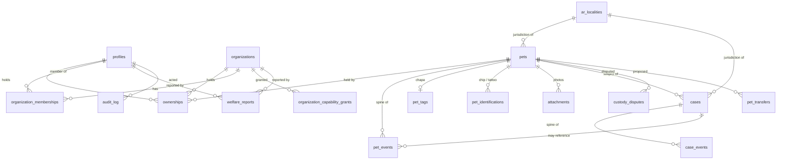
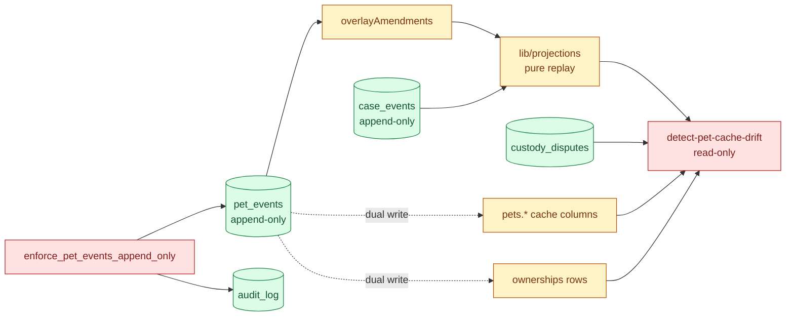

# Data model — the spine, the caches, and the line between them

> Snapshot: `c10f4ff03` (`main`) · Facts: `docs/architecture/facts.json` generated 2026-09-02
> Verified against code on 2026-09-02 by writer A (opus subagent) · Status: reviewed
> Numbers in this file are `<!-- fact:key -->` markers checked by `__tests__/architecture-facts.test.ts`.

`db/schema.ts` declares <!-- fact:tables -->59<!-- /fact --> tables and
<!-- fact:enums -->22<!-- /fact --> enums, over
<!-- fact:migrations -->255<!-- /fact --> forward-only SQL migrations under
`db/migrations`. This document is about the handful of them that carry the
system's meaning, and about the one distinction the rest of the pack depends on:
**which rows are the record, and which rows are a copy of the record kept for
speed.**

---

## 1. The invariant, in its own words

`CLAUDE.md` invariant 3 is called the *honest hybrid*, and it says three things
that must not be collapsed into one another:

1. **Lifecycle facts live only in the append-only event spine.** A vaccination,
   a death, a change of custody, a correction — each is a row in `pet_events` or
   `case_events`, and it is written once.
2. **Operational caches are dual-written on purpose.** `pets.status`,
   `pets.estimated_weight_kg`, the jurisdiction columns, the `ownerships` rows —
   a writer inserts the event *and* updates the column in the same transaction,
   because a dashboard cannot scan a timeline per row. This is a design
   decision, not a leak.
3. **A cache never outranks the spine, and it has to say so.** Every cached
   column is declared in one place (`lib/infra/rederive-pet-cache.ts`), is
   re-derived from the spine by one library, and is compared by one detector
   (`scripts/detect-pet-cache-drift.ts`). A column that is *not* re-derivable is
   listed as excluded, with the reason.

The wording matters because the slogan it replaced ("every view is a
projection") overclaimed, and the PO reworded it on 2026-07-24. Do not restore
the older, stronger sentence anywhere in this pack.

---

## 2. Core entities

Read the table names verbatim; the Drizzle export name is the camelCase twin.

| Table | Declared at | What it is |
|---|---|---|
| `profiles` | `db/schema.ts:299` | A person. Carries `role`, `account_type`, and the DNI **hash** plus last four digits — never the number |
| `pets` | `db/schema.ts:457` | The credential subject. `public_token` (`DIM-XXXX-XXXX`) is unique and is what a QR resolves |
| `ownerships` | `db/schema.ts:1073` | Who holds a pet, and in what role — five values in `ownershipRoleEnum` (`db/schema.ts:97-103`): `owner`, `co_owner`, `shelter_custody`, `foster`, `caretaker`. Polymorphic: a person **or** an organization, never both |
| `organizations` | `db/schema.ts:771` | Clinic, refugio, municipality-facing entity |
| `organization_memberships` | `db/schema.ts:954` | Person ↔ organization, with a membership role |
| `organization_capability_grants` | `db/schema.ts:997` | Which of the <!-- fact:org_capabilities -->16<!-- /fact --> capabilities (`ORGANIZATION_CAPABILITIES`, `db/schema.ts:206`) an org actually holds |
| `pet_events` | `db/schema.ts:1282` | **The spine.** Append-only |
| `cases` | `db/schema.ts:4043` | A lifecycle container: extravío, denuncia, custody episode, adoption application, decomiso… keyed by `case_kind` and a `public_code` |
| `case_events` | `db/schema.ts:4276` | **The case spine.** Append-only |
| `welfare_reports` | `db/schema.ts:1791` | Denuncia de bienestar animal — one of <!-- fact:denuncia_kinds -->9<!-- /fact --> kinds (`WELFARE_REPORT_KINDS`, `src/modules/welfare/domain/types.ts`). A `DEN-XXXX-XXXX` reference code lets an anonymous reporter come back |
| `pet_transfers` | `db/schema.ts:4500` | A proposed change of titularidad, before it is accepted |
| `pet_identifications` | `db/schema.ts:4582` | Canonical microchip and tattoo rows (migration 0084 moved them off `pets`) |
| `pet_tags` | `db/schema.ts:4681` | Physical chapa: serial plus an HMAC of the activation code, never SELECTed by app code |
| `attachments` | `db/schema.ts:1493` | Photos and documents; the private buckets are served through signed URLs |
| `audit_log` | `db/schema.ts:2598` | Actor-attributed record of privileged actions, including every spine-mutation override |
| `custody_disputes` | `db/schema.ts:3601` | Open disputes — the authoritative source for `pets.in_custody_dispute` |
| `ar_localities` | `db/schema.ts:3106` | The locality catalog every jurisdiction column normalizes against |

### 2.1 There is no `scan_events` table

`pet_events` carries the scan record as `credential_scanned` rows authored by the
`scanner` role. The cron directory `app/api/cron/purge-scan-events` and the
retention migration `db/migrations/0104_scan_events_retention.sql` name the
concept, not a table. Anyone looking for `scanEvents` in `db/schema.ts` will not
find it, and a diagram must not draw one.

### 2.2 Entity relationships

---

## 3. The event spine

### 3.1 Shape

`pet_events` (`db/schema.ts:1282`) is the interesting one. Its columns split into
four groups:

- **Identity and time** — `pet_id`, `event_type` (TEXT, *not* a `pgEnum`, so
  adding a type needs no migration), `occurred_at` (when it happened) and
  `recorded_at` (when we heard about it). Both are kept; a backdated vaccination
  is a real thing.
- **Provenance** — `recorded_by_user_id` (the person), `author_role`,
  `author_organization_id` (the institution they acted for) and
  `author_verified`.
- **Content** — a `jsonb` `payload` validated in application code, `notes`, and
  optional coordinates.
- **Wiring** — `case_id` (`ON DELETE RESTRICT`: an event predates any case
  deletion), `client_idempotency_key` for last-stable-wins retries, and a block
  of SENASA-aligned sanitary fields.

`case_events` (`db/schema.ts:4276`) is deliberately thinner: `case_id`,
`entry_type`, `payload`, `notes`, actor, `occurred_at`.

### 3.2 The catalog

<!-- fact:event_types -->55<!-- /fact --> event types live in
`packages/contract/src/events/event-types.ts` as a plain `const` array with zero
imports. It sits in `packages/contract` and not in `db/schema.ts` for one
concrete reason, written at the top of the file: a React Native client that
needs to name an event type must not have to install a Postgres ORM. The
dependency now runs the other way — `db/schema.ts` imports from the contract and
re-exports for compatibility, and `scripts/check-contract-purity.ts` keeps the
package free of runtime dependencies.

Corrections are new events. An `event_amended` row supersedes an earlier one,
and every read boundary folds it through `overlayAmendments`
(`lib/infra/amendment.ts`) rather than editing anything.

### 3.3 Append-only, by trigger — and the two hatches

`db/migrations/0127_pet_events_append_only.sql` is the migration that made the
lock real on a migrate-only deploy. Before it, the *function* shipped in a
migration while the *triggers* that bind it to the table lived only in
`db/triggers.sql`, applied by `scripts/db-bootstrap.ts` — so a production
`pnpm db:migrate` shipped `pet_events` with the function present and nothing
calling it (`db/migrations/0127_pet_events_append_only.sql:6-19`).

The bindings are at `db/migrations/0127_pet_events_append_only.sql:96-104`:
`pet_events_no_update` and `pet_events_no_delete`, both `BEFORE … FOR EACH ROW`.

The function has exactly two escape paths and a default refusal:

| Path | Lines | Requires | Writes |
|---|---|---|---|
| **Audited override** | `db/migrations/0127_pet_events_append_only.sql:41-64` | `app.allow_event_mutation = 'true'` **and** `app.allow_event_mutation_actor` set to a uuid in the same session — a missing actor raises `restrict_violation` | one `audit_log` row, action `pet_events_mutation_override`, carrying operation, event id, pet id, event type and `occurred_at`, plus allowlisted `old` / `new` images (other keys named in `redacted_keys`, no values), `changed_keys` and `notes_changed` since migration 0235 |
| **Scan purge** | `db/migrations/0127_pet_events_append_only.sql:66-88` | `DELETE` only, `app.allow_scan_purge = 'true'`, `author_role = 'scanner'`, `event_type = 'credential_scanned'`, and older than the retention window declared at `db/migrations/0127_pet_events_append_only.sql:39` | one `audit_log` row, action `scan_event_purged`, attributed to the system profile `00000000-0000-0000-0000-000000000235` since migration 0235 |
| **Everything else** | `db/migrations/0127_pet_events_append_only.sql:90-93` | — | raises `pet_events is append-only` with `restrict_violation` |

Two consequences to state rather than soften:

- **Never say "impossible to modify".** Say: *blocked by a database trigger,
  with one audited override that names its actor.* The override is
  transaction-scoped everywhere in this repo — every setter uses `set local` or
  `set_config(..., is_local => true)`, so it cannot leak across a pooled
  connection (`__tests__/_helpers/db-overrides.ts`, verified by lens A08 in
  `dim-interno:docs/reviews/2026-09-fresh/DECK-FACTS.md`).
- **`credential_scanned` rows are not permanent.** The retention window is a
  privacy decision, and the purge is the second hatch above. A scan is evidence
  for a season, not forever.

`case_events` got the same treatment in migration 0121; `audit_log` has had its
triggers in a migration since 0010.

### 3.4 The forgeable field

`pet_events.author_role` and `author_verified` are constrained by the PostgREST
INSERT policy on **ownership** and not on **provenance**, so a pet's own owner
can post an event claiming `author_role: "govt"`, `author_verified: true` — and
the append-only spine then makes the forgery permanent. That is finding `A02-1`
in `dim-interno:docs/reviews/2026-09-fresh/SYNTHESIS.md`, queued as migration 0212 and
**open at this snapshot**. Any slide that says "the history cannot be forged"
is wrong today.

---

## 4. Projections

`lib/projections` holds <!-- fact:projections -->13<!-- /fact --> pure replay
modules — no database, no framework, one `ProjectionEvent` shape
(`lib/projections/types.ts`) that deliberately omits the columns a projector
must not read.

| Module | Replays |
|---|---|
| `lib/projections/pet-status.ts` | `death_recorded` / `status_changed` → status, `deceased_at` |
| `lib/projections/pet-weight.ts` | `weight_recorded` → latest weight, interpreting the `changes` diff field by field |
| `lib/projections/pet-microchip.ts` | chip identity, country code, implant date, site |
| `lib/projections/pet-tattoo.ts` | tattoo code, location, description, date |
| `lib/projections/pet-pregnancy.ts` | `clinical_info_logged` with `sub_kind=pregnancy` |
| `lib/projections/pet-rabies-observation.ts` | observation start/end — deliberately **clockless** |
| `lib/projections/pet-jurisdiction.ts` | `pet_registered` and `movement_recorded` with `sub_kind=jurisdiction_changed`, raw |
| `lib/projections/pet-adoption-eligibility.ts` | `adoption_eligibility_set`, latest-wins |
| `lib/projections/pet-caretaker.ts` | `caretaker_designated` / `caretaker_ended` |
| `lib/projections/pet-compliance.ts` | compliance state for the credential badges |
| `lib/projections/travel-compliance.ts` | cross-border travel readiness |
| `lib/projections/first-steps-checklist.ts` | onboarding checklist state |
| `lib/projections/owner-confidence-display.ts` | the owner-facing confidence display |

Only the ones the cache harness imports — status, weight, microchip, tattoo,
pregnancy, rabies observation, jurisdiction and adoption eligibility
(`lib/infra/rederive-pet-cache.ts:83-93`) — feed the drift comparison. The rest
are read-side projections with no cached twin, which is why the drift detector
never mentions them.

---

## 5. Declared caches

`lib/infra/rederive-pet-cache.ts` is the single declaration. Its header states
the rule at `lib/infra/rederive-pet-cache.ts:19-22`:

> SOURCE OF TRUTH per column is documented inline. Most derive from pet_events;
> `inCustodyDispute` derives from the custody_disputes table (the authoritative
> source — a withdrawal flips the flag with no pet_event), so this is NOT a
> pure-event projection and is handled in the orchestrator.

### 5.1 What re-derives

`CHECKED_COLUMNS` (`lib/infra/rederive-pet-cache.ts:137-176`) names each cached
column together with the comparison strategy it needs — `strict`, `numeric`,
`dateOnly`, `instant`, `boolean`, and two special kinds:

- `implantSite` normalizes both sides through `chipImplantSiteFromLocation`,
  because the canonical enum and the legacy free-text form value are aliases.
- `observationStatus` forgives exactly one asymmetry: a stored
  `window_expired_unclosed` against a derived `in_progress`, because the daily
  sweep refines that status purely because a statutory window elapsed, and that
  transition writes no event. The reverse is drift
  (`lib/infra/rederive-pet-cache.ts:529-532`).

The harness reads the **corrected** stream: `overlayAmendments` is applied once,
at the source (`lib/infra/rederive-pet-cache.ts:326`), so an amended weight can
never register as permanent drift — and the repair script can never write the
pre-correction value back.

Two columns take their *stored* side from somewhere other than `pets`:
microchip and tattoo read the canonical `pet_identifications` row (ARCH-Q), and
`in_custody_dispute` reads `custody_disputes` in the orchestrator.

### 5.2 What does NOT re-derive

Listed at `lib/infra/rederive-pet-cache.ts:24-63`, with a reason each. Grouped:

| Group | Columns | Why excluded |
|---|---|---|
| Shelf-curated adoption listing | `adoption_listed_at`, `adoption_listing_paused_at`, `adoption_story`, `adoption_requirements`, `adoption_energy_level`, `adoption_size_estimate`, `adoption_age_bucket`, the three `adoption_good_with_*`, `adoption_needs_yard`, `adoption_fee_ars` | The writers emit no event at all |
| Rule-computed | `potentially_dangerous_breed` | Computed from breed and species (`lib/reference/breeds.ts`), not from events |
| UI preference | `emergency_info_visible`, the `disclose*_when_lost` flags, `tier2_public_enabled_until` | Flipping them emits no event, by design |
| PII / metadata | `created_by`, `updated_by`, `purpose`, `deleted_at`, `retention_until`, `created_at`, `updated_at` | Not domain facts |
| Conditions | `permanent_conditions`, `permanent_conditions_other`, `disclose_conditions_publicly`, `acquisition_method` | Dual-written; a faithful projection has to interpret the `changes` array field by field |
| Denormalized FK | `locality_id` | The three jurisdiction text columns already fail when the locality drifts |

The conditions row deserves its own sentence, because the file spends thirty
lines on it and the lesson generalises. The exclusion used to be justified by a
claim — "these are only ever updated through `pet_profile_updated`'s generic
`changes` diff" — that was **false**: `pet-diff.ts` omitted the three condition
columns entirely, so an owner edit touching only a condition wrote a cache
column with **no event**, and the exclusion meant nothing checked the gap. The
cache column was the only record of a medical fact published on the credential.
The bug is fixed and the sentence is true today, "but it was written as a reason
to skip the check, not as an observation, and it authorised the wrong conclusion
for six months" (`lib/infra/rederive-pet-cache.ts:44-53`).

`jurisdiction_country` / `_province` / `_locality` were in **neither** list
until 2026-08-12 — they fell through the gap in silence. They are checked now,
canonicalized on the derived side through the same `normalizeLocationForWrite`
the write path calls, so a locality rewritten to catalog spelling on write is
rewritten identically here.

### 5.3 Drift detection

- **In CI:** `__tests__/pet-cache-rederivation.test.ts`, with a non-vacuity twin.
- **In production:** `scripts/detect-pet-cache-drift.ts` — **read-only by
  design. It never writes and never auto-repairs**, because a mismatch can mean
  the cache is wrong (safe to recompute) *or* that the event stream is
  incomplete (recomputing would destroy the only correct value). It emits one
  JSON line per drifted pet, exit 1 when drift is found.

It reports two shapes: `pet_cache_drift` (columns vs the spine) and
`pet_caretaker_ownership_drift` (`ownerships` rows with `role='caretaker'` vs
`caretaker_designated` / `caretaker_ended`). **Every other ownership role —
`owner`, `co_owner`, `foster`, `shelter_custody` — has no drift detection at
all**, logged
as a known gap at `scripts/detect-pet-cache-drift.ts:30-36`. Custody of an
animal is the fact this system exists to hold, and only the caretaker role is
currently checked against the log.

### 5.4 Spine, projections, caches

---

## 6. Who may write, and what the database enforces

Two layers, and `docs/architecture/rls-coverage.md` is the authoritative
inventory.

- **Layer 1 — the action edge.** Every mutation goes through a Server Action or
  a route handler backed by Drizzle, and that connection is the `postgres` role
  with `BYPASSRLS`. `auth.uid()` is NULL there and RLS never fires. **App-layer
  guards are the only defense on this path.**
- **Layer 2 — RLS, over PostgREST only.**
  <!-- fact:rls_enabled_tables -->63<!-- /fact --> tables are DECLARED with
  `ENABLE ROW LEVEL SECURITY` across `db/rls.sql` and `db/migrations`; the live
  catalog reading lives in `__tests__/rls` and is the only authority on a running
  database. <!-- fact:security_definer_functions -->12<!-- /fact --> functions are
  declared `SECURITY DEFINER`.

<!-- fact:service_role_call_sites -->46<!-- /fact --> call sites construct the
service-role client. **Every one of them bypasses RLS by design** — that is what
the role is for — which is why the count is generated rather than argued about.

The failure mode this model has actually produced, twice: **a policy that pins
the row says nothing about the column.** `profiles` was row-scoped
(`id = auth.uid()`) and column-blind, so any authenticated user could `PATCH`
their own `role` to `admin`. It is closed —
`db/migrations/0211_profiles_lock_postgrest_writes.sql` drops the write policy
outright, leaving `profiles` with a SELECT policy and no PostgREST write surface
at all — and its sibling on the more important table (`pet_events`, §3.4) is
still open.

---

## 7. Reading this model on a slide

- Green = `pet_events`, `case_events`, `audit_log`, `custody_disputes`. The
  record.
- Amber = `pets.*` cache columns, `ownerships` rows, the projections. Copies and
  derivations.
- Red = the trigger and the drift detector. Controls.
- Never draw a `scan_events` table (§2.1); never claim the spine cannot be
  modified (§3.3); never claim provenance is trustworthy (§3.4).
