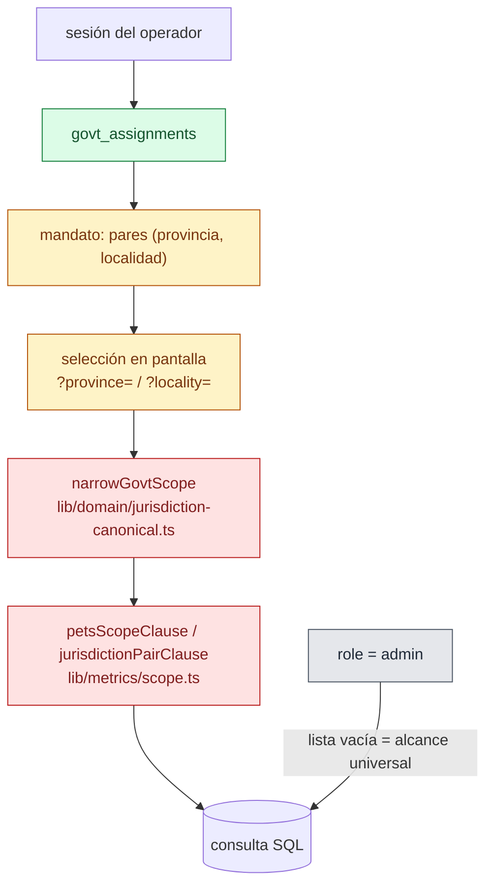

# Government views — what an operator sees, and what bounds it

> Snapshot: `c10f4ff03` (`main`) · Facts: `docs/architecture/facts.json` generated 2026-09-02
> Verified against code on 2026-09-02 by writer C (opus subagent) · Status: reviewed
> Numbers in this file are `<!-- fact:key -->` markers checked by `__tests__/architecture-facts.test.ts`.

## What this document answers

The `/gob` route group is the surface a municipal or provincial authority
works on. This page states which sections exist, what narrows them to a
territory, what contract the numbers on them carry, and which of those bounds
are enforced by code versus held by convention.

Authority resolution itself lives in `docs/architecture/authorization.md`;
k-anonymity and export privacy live in `docs/architecture/privacy-controls.md`.

## 1. The sections

Every `/gob` page passes through `app/gob/layout.tsx`, which calls
`requireAdminOrGovtOrRedirect` at `app/gob/layout.tsx:54` and short-circuits on
the maintenance kill-switch before any auth or data fetch. The rail is
`GOB_NAV_SECTIONS` (`components/layout/nav-presets.ts:440`), and it groups the
surface into six bands:

| Band | Entries | Route |
|---|---|---|
| (unlabeled) | Briefing | `app/gob/page.tsx` |
| Situación | Panorama, Vigilancia, Pérdidas, Observaciones | `app/gob/panorama`, `app/gob/vigilancia`, `app/gob/perdidas`, `app/gob/observaciones` |
| Programa | Programa, Padrón, Mortalidad, Adopciones | `app/gob/programa`, `app/gob/padron`, `app/gob/mortalidad`, `app/gob/adopciones` |
| Intervención | Operativos, Decomisos | `app/gob/operativos`, `app/gob/decomisos` |
| Bandeja operativa | Acciones que vencen, Denuncias, Aprobaciones, Casos, Bandeja de salida, Alertas y suscripciones | `app/gob/acciones`, `app/gob/denuncias`, `app/gob/cola`, `app/gob/casos`, `app/gob/outbox`, `app/gob/suscripciones` |
| Profundidad | Historial, Reglas, Directorio | `app/gob/historial`, `app/gob/reglas`, `app/gob/directorio` |

**The rail is smaller than the route tree, and that is deliberate.** Several
routes exist only as permanent redirects into a tabbed vista of a hub, kept for
old bookmarks. The fusions, each recorded in `components/layout/nav-presets.ts`
with its PO decision date:

- Padrón absorbs `app/gob/poblacion` and `app/gob/censo` as `?vista=` tabs.
- Programa absorbs `app/gob/analytics` (and the `app/gob/analitica` typo alias).
- Operativos absorbs `app/gob/campanas` and `app/gob/outreach`.
- Denuncias absorbs `app/gob/moderacion` and `app/gob/maltrato` as `?etapa=`
  stages — their `[id]` detail routes are unchanged.
- Casos absorbs `app/gob/disputas` as an `?expediente=` tab.
- Directorio absorbs `app/gob/organizaciones`, `app/gob/usuarios`,
  `app/gob/servicios` and `app/gob/rupga` as `?registro=` registers.
- `app/gob/sistema` is excluded from the rail for govt operators and folded into
  Programa; the route survives for deep links.

A nav entry and a route can disagree, and one instrument catches it:
`scripts/check-screen-manifest.ts` fails when the rail's section placement and
`lib/ui/screen-manifest.ts` disagree about a route's layer. The
`app/gob/observaciones` entry is the case worth remembering — the route shipped
on 2026-08-10 and the nav entry did not, so for a queue running a ten-day legal
clock the only way in was to already know the URL.

## 2. Narrow-only scope

The rule is **narrow only**. `resolveScopedJurisdictions`
(`lib/infra/gov-scope.ts:65`) returns an admin's list unchanged and hands a
govt's to `narrowGovtScope` (`lib/domain/jurisdiction-canonical.ts:226`), which
can only shrink the set the session already granted. A query parameter cannot
add a territory; at most it removes one.

Whole-province subsumption is one predicate expressed in three agreeing places
(`jurisdictionScopeContains`, `jurisdictionPairClause`, `narrowGovtScope`) so a
provincial operator picking a barrio keeps their provincial rows.
`lib/infra/gov-scope.ts:42-63` records why that helper is delegated to rather
than reimplemented: an inline exact-pair filter erased whole-province
assignments the moment a locality was picked, and the surface came back empty
for exactly the class of official being onboarded.

The scope clauses fail closed: `petsScopeClause` (`lib/metrics/scope.ts:94`)
emits a SQL `false` literal for an empty list (`:109`), so a govt with no
jurisdictions gets nothing rather than everything. Admin's empty list means
universal, and that overloading of "empty" is the seam every finding in this
area sits in.

Two fences and one ratchet watch this:

- `scripts/check-scope-discipline.ts` — a hand-rolled jurisdiction predicate
  under `lib/analytics` outside `lib/analytics/dashboards/_scope.ts` is flagged;
  existing ones are baselined in `scripts/scope-discipline-baseline.json`.
- `scripts/check-scope-authz.ts` — every table the scope layer narrows must have
  RLS enabled in the database, so the app's promise is not decoration.
- `scripts/check-authz-scoping.ts` — report-only, fails on per-file growth only.

The strongest behavioural evidence in this area is
`__tests__/gob-pet-subview-jurisdiction-fence.test.ts`: real Postgres, real SQL,
no mocks, proving that a govt operator who legitimately reaches a pet through an
in-scope welfare nexus still receives only the open cases inside their own
jurisdiction — sibling-barrio and out-of-province cases are excluded from the
payload, while admin gets all of them. The code under it is
`lib/infra/gob-pet-subview.ts`. `e2e/cross-tenant-isolation.spec.ts` carries the
browser-level govt and org operator probes.

**Open at this snapshot** (details in `dim-interno:docs/reviews/2026-09-fresh/lenses/A10.md`):

| id | Sev | What |
|---|---|---|
| `A10-1` | MED | The org tránsitos `historial` tab lists ended foster rows with no organization predicate |
| `A10-2` | MED | A govt proposal writes a client-supplied jurisdiction with no assignment check, landing in another jurisdiction's queue |
| `A10-3` | MED | Business-rule locality is trim-only, so a non-catalog spelling makes the rule inert while rendering as configured |
| `A10-4` | MED | The locality-integrity sweep covers `govt_assignments` and never `pets` |

`A01-2` (`fetchQueueHealthScoped` treating an empty list as universal, so a
`?province=` outside a govt's mandate returned NATIONAL approval-queue counts)
was closed on 2026-09-09: the fetcher now takes the page's `ProjectionContext`
and fails closed on an empty govt scope without a query, the contract every
other scope clause on this surface already had. Pinned by
`__tests__/queue-health-scoped-fail-closed.test.ts` over the real page path.

## 3. The KPI contract

`lib/metrics/kpi-catalog.ts` turns KPI documentation into an executable
contract. `KPI_CATALOG` (`lib/metrics/kpi-catalog.ts:368`) is a record keyed by
id, flattened into `KPI_CATALOG_LIST` at `:2446` —
<!-- fact:kpi_descriptors -->87<!-- /fact --> descriptors, spread in from two
sibling modules (`lib/metrics/kpi-catalog-queues.ts`,
`lib/metrics/kpi-catalog-compliance.ts`) so a single lookup serves every render
site.

Each descriptor declares, at minimum: `label`, `numerator`, `denominator`,
`source`, `fetcherName`, `fetcherPath`, `cadence`, `unit`, `suppression`,
`caveat`, `question`, and optionally `target` with a `sourceKind`.

Two of those fields carry the honesty of the whole surface:

- **`suppression`** states, per descriptor, whether k-anonymity applies and why
  — including "none", with the reason.
- **`target.sourceKind`** separates a legal mandate from a programmatic number.
  The rabies-coverage descriptor is the worked example: Ley 22.953 mandates the
  vaccination obligation, not a percentage threshold, so the law and the target
  figure render as two separate facts rather than one implied legal quota.

`lib/metrics/presentation-guards.ts` is what ENFORCES the descriptor's `guards`
block at render time, once, instead of every screen re-inventing "if N is small
do not paint red". Four guards, each killing one red-team-verified class of
dishonest rendering:

| Guard | Class it kills |
|---|---|
| `zeroDenominatorGate` | "0/0 → 0%" — renders the dash literal instead of a fabricated ratio |
| `smallNGate` | "100% with N=2" — the value stays honest, the tone is forced neutral, and a note explains why |
| `shouldSuppressDelta` | A period-over-period swing computed on an unstable prior base |
| `resolveSemaphoreTone` | The traffic light read as a legal verdict |

The module is pure — no DB, no React — and `components/ui/dashboard/OpKpi.tsx`
calls into it through an optional `descriptorId` / `guardInput` path.

Amendments are the other half of a number's honesty: a corrected event must
count under its current value, not its original one. The overlay is
`lib/infra/amendment-sql.ts` on the SQL side and `overlayAmendments` on the
replay side, and the metrics and analytics readers have adopted it. What is NOT
guaranteed is that a projection overlays on its own behalf —
`lib/projections/pet-compliance.ts` is a pure derivation over whatever array it
is handed, and the correctness depends on every caller remembering (`A05-7`,
LOW; the audit found every current production caller correct).

## 4. Panorama — the situational console

`app/gob/panorama/page.tsx` is a thin route; the console itself is
`components/panorama/PanoramaConsole.tsx` with the map in
`components/panorama/SituationalMap.tsx`. Both are among the largest files in
the repo — the console is pinned in `scripts/file-size-baseline.json` and the
B10 recount notes it currently sits above its pin, which is either a stale
baseline or a fence that is not failing. That is a stated open question, not a
resolved one.

The data plane is five route handlers under `app/api/panorama`, all gated by
`resolveInstitutionalPanoramaActor` (`app/api/panorama/_guard.ts:71`):

| Route | Serves |
|---|---|
| `app/api/panorama/kpis/route.ts` | The KPI tiles for the current scope and period |
| `app/api/panorama/[layer]/route.ts` | Choropleth features for one layer |
| `app/api/panorama/scope/route.ts` | The scope the console may offer |
| `app/api/panorama/unit-history/route.ts` | Per-unit history for a drill-down |
| `app/api/panorama/rule-changes/route.ts` | Rule-change markers on the timeline |

**Scope resolution is not uniform across those five, and the claim that it is
was refuted.** Only `kpis` and `[layer]` route through
`src/modules/panorama/application/resolve-request-scope.ts`; `unit-history`,
`rule-changes` and `scope` re-parse the province and locality parameters and
resolve scope inline. `unit-history` deliberately admits a PROVINCE-level
request from a barrio-grain operator, and what keeps that honest is a SECOND
fence in the repository (`src/modules/panorama/infrastructure/repository-history.ts`),
which ANDs the operator's own scope clause into every per-metric query. The
audit verified the mechanism by reading all of it and flagged that **no test
exercises it** — a barrio operator making a province-level request and asserting
barrio-only rows come back does not exist.

Suppressed cells on the map are nulled rather than zeroed
(`src/modules/panorama/application/load-layer-features-cube.ts`), and the
console renders a suppression notice
(`components/panorama/PanoramaSuppressionNotice.tsx`,
`components/panorama/all-suppressed-notice.tsx`) instead of an empty map. But a
companion total IS published — the mortality KPI equals the sum of the same
province's department cells, and the footer publishes the coverage denominator —
which is precisely limitation KA1/KA2 in
`docs/architecture/privacy-known-limitations.md`. The code says so itself, in a
comment labelled "KNOWN, NOT FIXED" at
`src/modules/panorama/application/get-panorama-kpis.ts:694`.

## 5. Exports

Four export lanes leave `/gob`, and they do NOT share one privacy posture. This
is the table to read before promising anything about an export.

| Lane | Where | Grain | k-anonymity |
|---|---|---|---|
| Datos abiertos (public) | `app/(public)/transparencia/datos/[dataset]/route.ts`, `lib/open-data/datasets.ts` | Province aggregate | YES — `OPEN_DATA_K = ANONYMITY_K`, complementary AND cross-dataset joint suppression (`lib/open-data/province-suppression.ts`) |
| Analytics export | `app/gob/analytics/export/actions.ts`, `lib/analytics/govt-exports.ts` | ROW level | NO — declared as limitation PD1 |
| SENASA / LSUCyF batch | `lib/analytics/senasa-export.ts` (pure core), `lib/analytics/senasa-export-query.ts` (scoped gather) | Event rows | Allowlist transform, not suppression |
| Campañas | `app/gob/campanas/export/route.ts`, `lib/analytics/campaign-metrics.ts` | Per-offering | Geo-reach IS suppressed; the per-offering list and CSV are not — limitation KA5 |

Two things about the analytics export are load-bearing and easy to get wrong.

**It is an allowlist, not a filter.** `anonymizeRows`
(`lib/analytics/govt-exports.ts:87`) parses each row through a non-strict Zod
schema, so an undeclared field is STRIPPED by construction — a new column on a
table cannot leak into an export by accident. The pets, events and cases slices
declare no name, owner, microchip, DNI, performer identity or coordinates, and
dates are bucketed to the month. The events slice carries an explicit
"INTENTIONALLY OMITTED" comment naming what it drops.

**It is also a row-level padrón with no cell suppression, and that is a written
PO decision.** `docs/architecture/privacy-known-limitations.md` PD1 is the
declaration: a spreadsheet `GROUP BY` over the CSV reconstructs the cells the
dashboards hide (measured 2026-08-22: 98% of mortality-by-locality cells are
under the threshold). The acceptance rests on two verified properties — every
fetcher fails closed for a scopeless govt, and every export writes an
`analytics_export_generated` audit row (`app/gob/analytics/export/actions.ts:279`)
carrying actor, schema version, slices, format, period, jurisdiction, storage
path and per-slice row counts. The operator-facing notice is
`app/gob/analytics/export/privacy-notice.ts:43`, asserted by
`__tests__/govt-exports.test.ts`; change the notice and the schema together.

The SENASA lane needs one sentence said plainly, because it is the most
mis-readable thing on this page: **the real SENASA on-the-wire format is NOT
known.** `lib/analytics/senasa-export.ts:11-15` says so. Everything implemented
is defined by the aligned internal schema, and the unknown byte layout is
isolated behind a formatter interface so the real one drops in once a
homologation spec lands. And there is **no automatic notification to any
external authority** — the system queues and measures its own outbox, and the
outbound trigger is follow-up work (`docs/onboarding/README.md`, funcionario
guide cuts).

The open-data lane publishes its own dictionary and methodology as documents:
`docs/datos-abiertos/diccionario.md` and `docs/datos-abiertos/metodologia.md`,
linked from the dataset descriptors (`lib/open-data/datasets.ts:208` and `:211`).

## 6. Denuncias review

`app/gob/denuncias/page.tsx` is the hub. Two stages behind one screen:
`?etapa=moderacion` is the upstream spam and abuse gate
(`app/gob/moderacion/ModeracionQueueScreen.tsx`), `?etapa=triage` is the daily
Ley 14.346 welfare queue (`app/gob/maltrato/MaltratoQueueScreen.tsx`). The
default is triage, because that is the heavy-traffic operational queue an
operator opens to answer "what do I work on now". The two screens are IMPORTED,
not rewritten — each keeps its own searchParams contract, query logic and auth
guard.

The public intake side has <!-- fact:denuncia_kinds -->9<!-- /fact --> kinds
(`WELFARE_REPORT_KINDS`, `src/modules/welfare/domain/types.ts:12`; mirrored by
the `welfare_report_kind` enum at `db/schema.ts:247`). "Mordedura" is not one of
them — a bite travels the clinical and organizational circuit, not the denuncia
funnel. `docs/onboarding/README.md` records this as a correction already made to
the public help page.

Two structural facts about the denuncia that govern what an operator may see:

- **Identity and content are separated at the database.** Migration 0186 created
  two `security_invoker` views, and the reporter-identity side is revoked from
  `PUBLIC`, `anon` and `authenticated` outright. Migration 0210 had to drop and
  recreate the content view and restated both the revoke and the asymmetric
  grant rather than trusting Postgres to carry them. Since T3-F1 (`A02-3`)
  `__tests__/rls/coverage.test.ts` enumerates every view in the project schemas
  and fails one without `security_invoker`, so a future recreate that drops it
  goes red instead of silently executing as owner.
- **Moderation authority is scoped, not universal.**
  `requireDenunciaModerationPrincipal` (`lib/infra/auth-guards.ts:307`) gives
  admin universal scope and govt their own assignments, and the guard's header
  states that per-row jurisdiction enforcement is the CALLER'S responsibility.
  A flagged report with no jurisdiction is in no govt's scope and stays
  admin-only.

There is **no derivation to external state channels**. The public flow page says
so itself, and the internal queue is what exists. An operator briefing must not
present miMAR as an emergency channel.

## 7. How to read a number on these screens

Four independent things can make a `/gob` number mean less than it looks:

1. **Scope.** Empty means universal for admin and fail-closed for govt. If a
   screen shows national figures to a jurisdiction operator, that is a bug, not
   a feature — and `A01-2` is one live instance of exactly that shape.
2. **Suppression.** The descriptor's `suppression` field says whether k applies.
   Where it says "none", the reason is stated.
3. **Guards.** A dash is not zero, and a neutral-toned rate with a small-sample
   note is not a trend.
4. **Coverage.** Every metric counts what miMAR knows. Real-world coverage may
   be higher; the rabies descriptor's `caveat` says this in as many words.

## Related documents

- `docs/architecture/authorization.md` — how an operator's authority is resolved
- `docs/architecture/privacy-controls.md` — k-anonymity, exports, redaction
- `docs/architecture/privacy-known-limitations.md` — KA1/KA2, KA5, PD1
- `docs/datos-abiertos/metodologia.md` — the public open-data methodology
- `dim-interno:docs/reviews/2026-09-fresh/lenses/A10.md` — jurisdiction, org tenant, dashboards
- `dim-interno:docs/reviews/2026-09-fresh/BACKLOG.md` — every open finding, ranked
