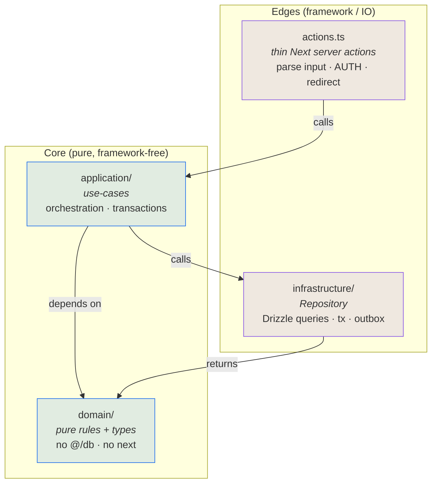
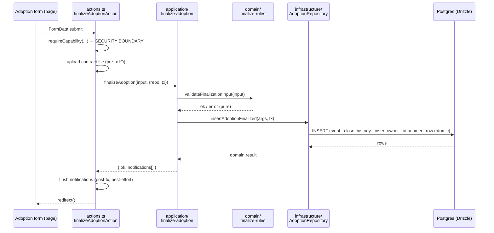
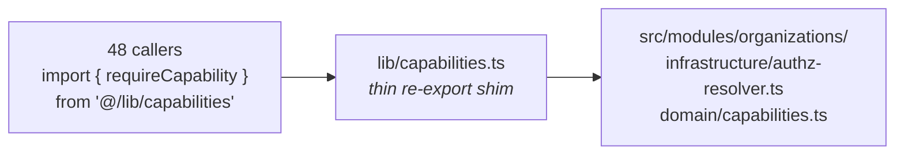

# DIM Architecture — Hexagonal-lite + Screaming Architecture

> Snapshot: `c10f4ff03` (`main`) · Facts: `docs/architecture/facts.json` generated 2026-09-02
> Verified against code on 2026-09-02 by writer D (sonnet subagent) · Status: reviewed
> Numbers in this file are `<!-- fact:key -->` markers checked by `__tests__/architecture-facts.test.ts`.

> Status: **adopted** · Applies to: all backend logic (server actions, business rules, persistence)
> Companion docs: [`AGENTS.md`](../../AGENTS.md) (domain model & event-sourcing principles), [`CONTRIBUTING.md`](../../CONTRIBUTING.md)
> Related diagrams: `dim-interno:docs/presentation/2026-09-oficiales/04-espina-eventos-y-caches.md` (the event-spine + cache diagram this pattern backs) and `docs/architecture/README.md` (the full doc map).

---

## TL;DR

Business logic used to live inside **fat server actions** — single functions (some over 2,900 lines) that mixed auth, validation, business rules, raw Drizzle queries, and side-effects. That made rules hard to test, hard to find, and hard to change without fear.

We refactored every domain into **`src/modules/<domain>/`** with four layers and one hard rule: **dependencies point inward.** The domain core is pure and framework-free; the database and Next.js live at the edges.

This is **Hexagonal-lite**: the *spirit* of Ports & Adapters (domain at the center, infrastructure at the rim) **without** the full ceremony (no entity-mapper per table, no port interface for everything, no Unit of Work). It respects the project's event-sourced grain instead of fighting it.

It is also **Screaming Architecture**: the folder tree screams *what the app does* (`adoption`, `foster`, `surveillance`…), not *what framework it uses*.

---

## Why (the problem we were solving)

| Before | After |
|---|---|
| `app/actions/events.ts` = 2,919 lines, 20 functions | Each event is a use-case; `events.ts` is now a 142-line shim |
| Business rules tangled with `db.select(...)` calls | Rules are pure functions in `domain/`, unit-tested without a DB |
| Auth, validation, side-effects all inline | Auth at the action edge; orchestration in use-cases; persistence in repositories |
| No clear place for a rule to live | One obvious home per concern, per domain |
| To test a rule you needed Postgres + Next | Domain tests are pure and fast; only repositories need Postgres |

The goal was **maintainability and testability of business rules on a live product** — without freezing feature delivery and without rewriting the event-sourcing foundation that already works.

---

## The four layers and the dependency rule



**The one rule: dependencies point inward.** `domain/` knows about *nothing* outside itself. `application/` knows `domain/` and depends on repository *behavior*. `actions.ts` and `infrastructure/` are the only layers that touch the framework (Next.js) and the database (Drizzle).

| Layer | Responsibility | May import | May NOT import |
|---|---|---|---|
| **`domain/`** | Pure business rules, value types, state machines, validation, classification. Deterministic, no IO. | other `domain/` files, `@/db/schema` **types only** | `@/db` (runtime), `drizzle-orm`, `next`, any repository |
| **`application/`** | Use-cases: orchestrate a single operation. Open a transaction, call the repository, collect post-tx notifications, return a `Result`. | `domain/`, repository (by shape) | `next`, raw `@/db` queries |
| **`infrastructure/`** | Repository: the *only* place that issues Drizzle queries. Thin over the ORM, transaction-threaded, returns domain-shaped data. | `@/db`, `drizzle-orm`, `domain/` | `next`, `application/` |
| **`actions.ts`** | Thin Next.js `"use server"` controllers: parse `FormData`, run the **auth guard (security boundary)**, build the input DTO, invoke the use-case, flush best-effort notifications, `redirect`. No business rules. | everything below it | — |

> The inward rule for `domain/` is **enforced by Biome** (`noRestrictedImports` on `src/modules/*/domain/**` blocks `@/db`, `drizzle-orm`, `next`). It's a guardrail, not just a convention.

---

## Anatomy of a module

```
src/modules/adoption/
├── domain/                      # pure — no framework, no DB
│   ├── types.ts                 # DTOs / value shapes
│   ├── eligibility-rules.ts     # validateEligibilityInput(...)
│   ├── listing-rules.ts         # isListable(...), validatePublish(...)
│   ├── finalize-rules.ts        # validateFinalizationInput(...)
│   └── __tests__/               # fast pure unit tests
├── application/                 # use-cases — orchestration
│   ├── finalize-adoption.ts     # FinalizeAdoption(input, deps)
│   ├── submit-adoption-application.ts
│   ├── set-adoption-eligibility.ts
│   └── __tests__/               # unit tests with a fake repository
├── infrastructure/              # the only place with Drizzle
│   ├── adoption-repository.ts   # tx-threaded queries, returns domain types
│   └── __tests__/               # integration tests (real Postgres)
└── actions.ts                   # thin "use server" controllers
```

Every domain follows the same shape, so once you learn one you can read them all.

---

## A concrete walkthrough — *finalize an adoption*



Notice the separation:
- **Auth stays in the action.** Drizzle bypasses Postgres RLS by design, so the action is the security boundary. The use-case receives an already-authorized context.
- **Rules are pure.** `validateFinalizationInput` has no DB — it's tested in milliseconds.
- **Atomicity is explicit.** The repository takes the transaction (`tx`); multi-step writes commit together. No hidden Unit of Work.
- **Notifications are best-effort, post-transaction.** A failed notification never rolls back the adoption.

---

## Shared kernels & the strangler strategy

Two concerns are used by *almost every* module and could not be moved with a big-bang repoint on a live product:

- **`cases`** — the case state-machine (`openCase`/`closeCase`/lifecycles/auto-closers).
- **`organizations`** — the authorization core, `requireCapability`, imported by ~30–48 files.

For these we kept the old paths (`lib/case-helpers.ts`, `lib/capabilities.ts`, …) as **thin re-export shims** that delegate into the new module. Every existing caller keeps working **unchanged**; the logic moved, the import path didn't.



This is the **strangler pattern**: the new implementation grows around the old seam; the old file is reduced to a pass-through and deleted only once every importer is repointed (a low-risk follow-up).

### Strangler migration status — `app/actions/` (as of 2026-06-26)

> **Status: IN PROGRESS — two files are fully migrated (`events`, `decomiso`).**

The `events` module is the completed reference slice: the old `app/actions/events.ts` (≈2,920 lines) has been replaced by a thin shim in `src/modules/events/actions.ts`, and all business logic lives in `src/modules/events/application/`. The shim now lives at `src/modules/events/actions.ts`; the `app/actions/events.ts` path no longer exists.

`decomiso` is a second completed slice, cut differently: `app/actions/decomiso.ts` stayed in place (still the caller-facing path) but shrank from 1,574 to 411 lines — it is now a thin controller (parse → auth → call use-case → redirect) delegating into `src/modules/decomiso/application/` (`validateExecuteDecomiso`, `validateReassignDecomiso`, plus the handoff accept/reject use-cases). No re-export shim needed here since the action file itself never moved.

The remaining **~60 files in `app/actions/`** are still fat actions pending migration. The largest files by line count:

| File | Lines | Notes |
|---|---|---|
| `return-to-owner.ts` | 1,929 | Critical flow — needs extra parity coverage + browser QA |
| `admin-institutional.ts` | 915 | |
| `service-offerings.ts` | 782 | |
| `bulk-pet-events.ts` | 752 | |
| `custody-disputes.ts` | 729 | |
| `upgrade.ts` | 667 | |
| `admin-revocations.ts` | 606 | |
| `profile-self-service.ts` | 510 | |
| `pet-claim.ts` | 495 | |

The ordered migration backlog and per-file recipe are in
[`docs/superpowers/plans/2026-06-26-strangler-finish-plan.md`](../superpowers/plans/2026-06-26-strangler-finish-plan.md).

A **CI line-budget ratchet** (`pnpm lint:actions`) prevents existing fat actions from
growing further and caps new `app/actions/*.ts` files at 150 lines. This stops the
bleeding while migration proceeds file-by-file.

### Strangler cut (per-file recipe)

The recipe below applies to every file in the backlog:

1. **Scaffold** `src/modules/<domain>/{domain,application,infrastructure}/` if not already present.
2. **Domain first (test-first):** extract pure rules from the fat action; reuse existing projections and lifecycles.
3. **Repository:** wrap the Drizzle queries, transaction-threaded, returning domain types. Integration-test against Postgres.
4. **Use-cases:** one per operation; inject repo + authorized context; orchestrate; collect post-tx notifications.
5. **Thin actions:** parse → auth → call use-case → flush → redirect. No business rules.
6. **Parity tests:** verify the new path produces identical side-effects, audit rows, idempotency keys, and cascade closes as the original.
7. **Delete the fat body** in `app/actions/<file>.ts` — replace with a re-export shim if callers reference the old path, or delete outright if the new `src/modules/` path is the only entry point.
8. **Verify:** `pnpm lint:actions` must still pass (file shrinks → within budget).

---

## Relationship to event-sourcing

This architecture **layers on top of** the principles in [`AGENTS.md`](../../AGENTS.md) — it does not replace them:

- **Events are still the spine.** Use-cases append immutable events; repositories persist them.
- **Projections are still first-class.** The pure projection functions (`lib/projections/*`) are exactly the kind of code that belongs in `domain/` — and the modules reuse them rather than reimplementing.
- Hexagonal-lite simply gives those events, rules, and projections **a consistent home and a testable boundary**.

---

## Rules & conventions (do / don't)

✅ **Do**
- Put a rule with no IO in `domain/`. If you're tempted to query the DB there, you're in the wrong layer.
- Keep `actions.ts` thin: parse → auth → call use-case → redirect.
- Thread the transaction through the repository for multi-step writes.
- Collect notifications and flush them **after** the transaction (best-effort).
- Use the transaction idiom that survives strict TypeScript:
  ```ts
  const r = await transaction(async (tx) =>
    repo.method(args, tx as Parameters<typeof repo.method>[1]),
  );
  ```

🚫 **Don't**
- Don't import `@/db`, `drizzle-orm`, or `next` inside `domain/` (Biome will reject it).
- Don't run auth checks inside use-cases — the action is the security boundary.
- Don't widen an action's authorization scope. Scope to the *correct* org/owner (a cross-org capability check that ignores the resource's org is a security bug).
- Don't drop side-effects on migration: `audit_log` rows, idempotency keys, and cascade closes are **behavior** — preserve them byte-for-byte.

---

## Testing strategy (strict TDD)

| Layer | Test kind | Needs Postgres? | Speed |
|---|---|---|---|
| `domain/` | pure unit | no | fast |
| `application/` | unit with a **fake repository** | no | fast |
| `infrastructure/` | integration vs **real Postgres** | yes | slower (serial) |
| `actions.ts` | parity tests (auth path, redirect, post-tx flush) | mocked | fast |

Coverage thresholds: **90% branches** on domain rules, **70–75%** on the module/action layer. `vitest.config.ts` includes `src/**` so the new modules are actually measured (not vacuously passing).

Each migration was independently **verified** against the deleted original for behavior parity. That adversarial pass caught real regressions before they shipped (a cross-org auth bypass, a missing audit trail, a lost idempotency key) — which is exactly why it exists.

---

## How to add or migrate a domain

1. **Scaffold** `src/modules/<domain>/{domain,application,infrastructure}/`.
2. **Domain first (test-first):** extract pure rules from the existing fat action; reuse existing pure code (projections, lifecycles).
3. **Repository:** wrap the Drizzle queries, transaction-threaded, returning domain types. Integration-test against Postgres.
4. **Use-cases:** one per operation; inject the repository + authorized context; orchestrate the transaction; collect post-tx notifications.
5. **Thin actions:** parse → auth at the edge (scope correctly!) → call use-case → flush → redirect.
6. **Strangler cut:** repoint consumers (or leave a re-export shim for widely-imported kernels). Delete the old fat action **only after parity tests are green**.
7. **Verify** against the original for parity, then ship.

---

## Module map

| Module | Replaces (old fat actions) | Migration status |
|---|---|---|
| `adoption` | `adoption*.ts` | done — reference slice |
| `pets` | `pets.ts` | done |
| `foster` | `foster*.ts` | done |
| `transfers` | `pet-transfer.ts`, `cross-org-transfer.ts`, `transfer.ts` | done — 3 sub-flows |
| `cases` | `lib/case-*` | done — **shared kernel** (shims in `lib/`) |
| `welfare` | `welfare*.ts` | done — rate-limit, moderation, escalation |
| `surveillance` | `bite.ts`, `outbreak-investigation.ts`, ENO | done — bite / rabies / ENO / outbreak |
| `organizations` | `org*.ts`, `lib/capabilities.ts` | done — **auth kernel** (shims in `lib/`) |
| `events` | `events.ts` → `src/modules/events/actions.ts` | **done** — 2,919 → thin shim, only fully-relocated action file |
| `decomiso` | `decomiso.ts` (stays in place, calls into the module) | **done** — 1,574 → 411 lines, thin controller |
| _(remaining ~60 files)_ | `app/actions/*.ts` | **pending** — see [strangler plan](../superpowers/plans/2026-06-26-strangler-finish-plan.md) |

---

## Known follow-ups (tracked, non-blocking)

- Remove the `lib/*` re-export shims once every importer is repointed (capabilities, case-helpers, eno-*, rabies-*, event-schemas, welfare-moderation).
- `cases`: extract the read-model query repository (deferred WU).
- A small number of pre-existing **flaky tests** (DB-state isolation under the full serial suite) predate this work and should be addressed separately.

---

## Pattern B — Population-level aggregate projections (`lib/metrics/`)

> Introduced: metrics-IA Item 0. Canonical foundation for all government dashboard KPIs and charts.

Hexagonal-lite governs the **per-pet event replay** path (Pattern A). A second, orthogonal pattern governs **population-level SQL aggregates** — dashboard KPIs such as vaccination coverage, bites per 10k inhabitants, and locality-grouped case counts. Call it **Pattern B**.

### Why Pattern B is distinct

Pattern A (per-pet event replay) is correct for a single animal's lifecycle but too slow for dashboard aggregates across an entire jurisdiction. Pattern B reads denormalized **pets.status** / **pets.species** columns and issues `COUNT()`/`GROUP BY` SQL directly. This is intentional (invariant D7): at population scale the columnar read is the right tool.

Because Pattern B aggregates skip event replay, their boundary must be clearly owned:

- **All Pattern-B fetchers share one authority on scope, denominators, and suppression.**
- **Privacy enforcement (k-anonymity, k=5) is mandatory.** AGENTS.md §Aggregation has required it since the beginning; `lib/metrics/anonymity.ts` is now the enforcement boundary.

### `lib/metrics/` structure

```
lib/metrics/
├── types.ts        — Cell, SuppressedCells (branded), MetricResult<T>
├── context.ts      — ProjectionContext, buildProjectionContext, ctxKey
├── scope.ts        — petsScopeClause, petEventsScopeClause (single source)
├── period.ts       — resolveAnalyticsPeriod re-export + windows factory
├── population.ts   — activePetsCondition, dogsInScopeCondition (shared denominators)
├── anonymity.ts    — suppressSmallCells (k=5 default), suppressedMetric
├── cache.ts        — React.cache dedup: cachedActivePetCount, cachedDogCount
└── index.ts        — barrel
```

### ProjectionContext

Every Pattern-B fetcher takes a **single `ProjectionContext`** argument:

```ts
type ProjectionContext = {
  actor:  DashboardActor;   // { role: 'admin' | 'govt' }
  scope:  ProjectionScope;  // { kind: 'global' } | { kind: 'jurisdictions', jurisdictions[] }
  period: AnalyticsPeriod;  // { since: Date, until: Date }
};
```

Build it **once per page** via `buildProjectionContext(actor, jurisdictions, period)` and pass the same instance to every tile fetcher. This is what makes React.cache dedup work: `cachedActivePetCount(ctx)` and other memoized base-population queries use `ctxKey(ctx)` as the cache surrogate, so multiple tiles sharing the same scope+period issue only one DB round-trip per request.

### K-anonymity invariant

All locality-grouped outputs that expose counts per jurisdiction **must** pass through `suppressSmallCells`:

```ts
const { visible, suppressedCount } = suppressSmallCells(rows, {
  count: (r) => r.count,
  key: (r) => r.locality,
  // rollup: (suppressed) => ({ locality: 'Otras localidades', count: suppressed.reduce(...) })
});
```

`SuppressedCells` is a **branded type** — raw `Cell[]` is NOT assignable to it. The brand is applied only inside `suppressSmallCells`; you cannot accidentally skip suppression and still compile.

### Dependency rule for Pattern B

`lib/metrics/` is **infrastructure-adjacent**: it reads `@/db` (Drizzle) and must not be imported from `domain/` or `application/`. Fetchers in `lib/govt-home-kpis.ts` and `lib/govt-dashboards.ts` are the intended consumers. Items 2/3/4 of the metrics-IA umbrella build their new metric fetchers natively on these exports.

### Testing Pattern B

| Test kind | Location | Needs Postgres? |
|---|---|---|
| `suppressSmallCells` / `suppressedMetric` — pure | `lib/metrics/anonymity.test.ts` | no |
| `resolveAnalyticsPeriod` / `windows` — pure | `lib/metrics/period.test.ts` | no |
| Scope + population primitives — integration | `__tests__/metrics-scope.test.ts` | yes |
| KPI fetchers (value-pinning) — integration | `__tests__/govt-home-kpis.test.ts` | yes |
| Bucketing transforms (`timeseries.ts`) — pure | `lib/metrics/timeseries.test.ts` | no |
| Trend **projection / forecast** (`forecast.ts`) — pure | `lib/metrics/forecast.test.ts` | no |

### Pure projection → pure forecast (Paquete J)

Pattern B's pure-vs-impure split extends naturally to forecasting. The DB-bound
trend fetchers (`lib/metrics/trends.ts`) produce the bucketed `{x,y}[]` series;
the forward **projection** (`lib/metrics/forecast.ts` — `projectSeries`,
`targetCrossing`) is a **pure transform the page delegates to**, exactly like
`timeseries.ts` is the pure transform `trends.ts` delegates to. It takes the
already-bucketed, k-anonymised series and returns a confidence band + an
estimated target-crossing with **no DB and no Next.js runtime**, so the
regression math (OLS slope, the horizon-widening interval, the `< MIN_POINTS`
abstention) is unit-tested in milliseconds. The chart (`ForecastChart`) is the
presentation edge; the projection itself is framework-free.

### Pure firing domain → DB writer (Paquete K — alert inbox)

The alert-triage feature (`/admin/alertas`) keeps the same pure-vs-impure split.
The decision logic lives in a **pure domain module** — `lib/metrics/alert-firing.ts`
(`shouldOpenFiring`, the validated `nextStatus` state machine, `metricOpensInvestigation`,
`investigationDiseaseCode`) — with **no `@/db`, no `next`**, so the dedup gate and
every legal/illegal state transition are unit-tested in milliseconds
(`lib/metrics/alert-firing.test.ts`). The **writer** that turns those decisions into
rows lives at the edge in `app/actions/alert-firings.ts`: it runs the existing
`evaluateAlertSubscriptions` evaluator, asks the pure `shouldOpenFiring` whether to
INSERT an `alert_firings` row (one open firing per subscription — no spam), and the
triage actions delegate each transition to the pure `nextStatus` before writing the
`*_at`/`*_by` audit columns. The daily `api/cron/evaluate-alerts` route is just an
auth-gated trigger over the same writer. The pure core decides; the action/cron edge
persists — exactly the Pattern-B grain.
