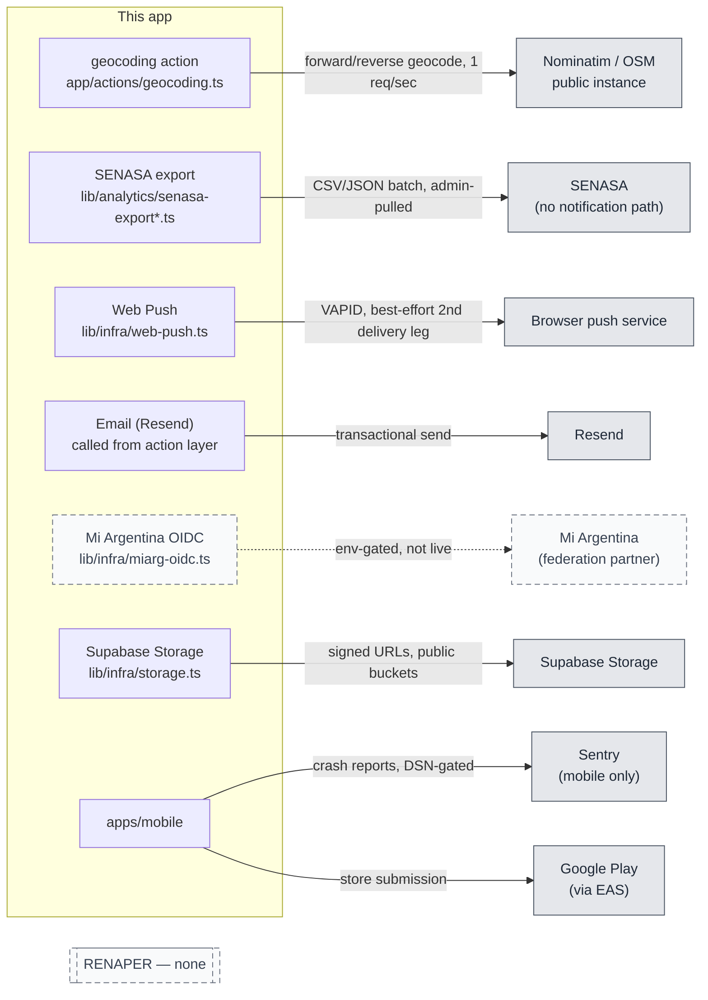

# External integrations — honest status per surface

> Snapshot: `c10f4ff03` (`main`) · Facts: `docs/architecture/facts.json` generated 2026-09-02
> Verified against code on 2026-09-02 by writer D (sonnet subagent) · Status: reviewed
> Numbers in this file are `<!-- fact:key -->` markers checked by `__tests__/architecture-facts.test.ts`.

Every system this codebase reaches outside itself, or claims it will reach,
with a STATUS line that says exactly what exists today: **live** (wired,
keyed, actually used in production paths), **export-only** (we produce data
for the other side; nothing comes back), **stub** (the shape exists, gated
off, waiting on credentials or a decision), **planned** (documented, not
started), or **none** (deliberately not built, stated so nobody promises it
in copy). This file draws the same STATUS vocabulary
`lib/infra/outbound-channels.ts` already uses for the three channels it governs
(`configured` / `restricted` / `unconfigured` / `not-built`) — that module is
quoted directly in §3 and §4 rather than paraphrased.

## 1. Nominatim proxy (geocoding) — STATUS: live

**No `/api/**` route handler** — this integration is a **Server Action**, not
a fetch-able endpoint. The chain: `app/actions/geocoding.ts` (a thin
`"use server"` shim, strangler migration 47/61) → `geocodeAddressAction` /
`reverseGeocodeAction` / the two `*PublicAction` anonymous variants, delegated
to `src/modules/localities/application/geocoding/geocoding.ts`, which calls
the actual proxy in `lib/infra/geocoding.ts`. That file's own header states
the shape: "Pure server-side proxy to Nominatim/OSM for forward and reverse
geocoding" — a public Nominatim instance is treated as the only reachable
option, self-hosted Nominatim-compatible instances are supported by
configuration, and callers respect Nominatim's 1 req/sec sustained policy
plus a debounced client. The **authenticated** actions run through
`requireUserOrRedirect`; the two **public** actions
(`geocodeAddressPublicAction`, `reverseGeocodePublicAction`) are
`@no-auth-required` on purpose — anonymous geocoding autocomplete on public
surfaces (`PetSightingForm`, the denuncia wizard) — and are IP rate-limited
via `enforceRateLimit` rather than session-gated. Per spec D10, the server
never logs the query string.

## 2. SENASA export — STATUS: export-only

Two files split the pure transform from the DB query, on purpose:
`lib/analytics/senasa-export.ts` is the **pure core** (types, vocabulary
resolution, the privacy-allowlisting transform, the CSV formatter) — no
database import, so the transform and formatters are unit-testable without a
connection. `lib/analytics/senasa-export-query.ts` is the IO stage: the scoped
gather that gathers the rows for the pure core to shape. The file's own header
states the honest limit: "the real SENASA on-the-wire format is NOT known" —
everything emitted is defined by this project's own aligned schema (`ref.*`
vocabulary + the SENASA columns migration 0061 added to `pet_events`), and
the unknown real byte layout is isolated behind a pluggable
`SenasaFormatter` interface so the real formatter can drop in later with zero
upstream change. There is **no notification path to SENASA** — this is a
batch pull an operator generates and downloads (`dim-interno:docs/design/sdd/2026-07-07-senasa-lsucyf-batch-export.md`),
never a push, and never a webhook or callback in either direction.

## 3. Web push — STATUS: live, env-gated (best-effort second delivery leg)

`lib/infra/web-push.ts`, quoted from its own header: "the `notifications`
table stays the source of truth; Web Push is a best-effort SECOND delivery
leg attached to the existing transport-agnostic seam" (ADR
`2026-07-18-native-readiness.md` §4) — use-cases return `NewNotification[]`,
the action layer flushes them post-transaction, and v1 pushes **URGENT** rows
only (avistajes / hallazgos / custodia). The fail-soft contract is explicit:
nothing in the module ever throws to the caller, because the in-app
notification row is already durable and push is opportunistic on top of it —
a push failure is reported (`reportError`), never silent, but never blocking.
Enablement requires **both** `NEXT_PUBLIC_PUSH_ENABLED` and the VAPID key
pair (`NEXT_PUBLIC_VAPID_PUBLIC_KEY` + `VAPID_PRIVATE_KEY`); either half
missing is treated as a full misconfiguration, not a partial capability
(`lib/infra/outbound-channels.ts`'s `deriveOutboundChannels`).

**No dead-letter queue was found.** `lib/infra/push-subscription-store.ts`
holds the subscription rows; a search of that module and `web-push.ts` for
expiry pruning, retry queues, or an "undeliverable" state returned nothing —
a subscription that starts silently rejecting pushes (a stale endpoint, a
revoked browser permission) is not detected or cleaned up by this code today.
That is a gap, stated rather than assumed away, not a claim that one exists
under a different name.

## 4. Mi Argentina — STATUS: stub, env-gated

**The premise, not a feature** (`CLAUDE.md` invariant 6: "no decision may
harm that path"). Four files carry the full stub:

- `lib/infra/miarg-oidc.ts` — the OIDC integration **shape**: env var names,
  the claim type expected from Mi Argentina, and the single gate,
  `isMiArgOidcEnabled()`, which requires all four of `MIARG_OIDC_ISSUER`,
  `MIARG_OIDC_CLIENT_ID`, `MIARG_OIDC_CLIENT_SECRET` and
  `MIARG_OIDC_REDIRECT_URI` to be present. The file's own header lists what is
  **NOT** implemented: the real HTTP redirect to Mi Argentina's authorization
  endpoint, PKCE code-verifier/state generation and validation, the
  authorization-code → token exchange, JWK verification of the `id_token`,
  and the real end-to-end `handleMiArgCallback()` path. This is Wave 5 Item
  25a; the real connection is Item 25b, explicitly gated on owner
  credentials Mi Argentina has not issued.
- `app/auth/miarg/callback/route.ts` — the callback route exists and returns
  404/501 until `isMiArgOidcEnabled()` is true.
- `app/admin/acerca/integracion-miarg/page.tsx` — the operator-facing page
  that states this status, so an admin does not have to read source to learn
  it.
- `dim-interno:docs/design/sdd/2026-07-07-miargentina-federation.md` — the federation
  design doc this stub was scaffolded from.

When the env vars are absent (every environment today, including staging),
email/password auth is completely unchanged and the OIDC path is invisible to
users — the gate function is the entire blast radius.

## 5. RENAPER — STATUS: none

No RENAPER integration exists in code. A repo-wide search for `RENAPER` /
`renaper` returns only prose — design docs, onboarding guides, `AGENTS.md`
— never a source file that calls out to it. DNI verification in this product
is **self-declared by the owner** (`lib/utils/dni-hash.ts` hashes what the
user types; nothing cross-checks it against a national identity registry).
This is stated here rather than implied by silence, because "no RENAPER
notification" is one of the known limits every diagram touching identity must
surface (per the shared brief for this doc pack).

## 6. Sentry — STATUS: mobile only, DSN-gated

`apps/mobile/src/observability/sentry.ts` is the entire integration, and its
own header states the scope plainly: **the web app has no Sentry** — only
`apps/mobile` does. Why it exists at all: "fourteen testers on unknown
Android phones, none of whom will attach a logcat to an email" — without a
crash reporter every native or JS crash on the pilot is an unreproducible
anecdote. The DSN travels through `apps/mobile/app.config.ts` from the EAS build
environment (`SENTRY_DSN`, no `EXPO_PUBLIC_` prefix, so it never reaches
`process.env` in the shipped bundle) as `extra.sentryDsn`; a build with no
DSN — local dev, a fork, an emulator run — resolves to `null` and
`initSentry()` deliberately does nothing, rather than initializing with a
garbage DSN that would retry uploads forever. Two things are turned off on
purpose: `sendDefaultPii` (this product hashes DNIs at the boundary —
invariant 5 — and the crash reporter does not get to be the exception that
ships identifying data by accident) and tracing (`tracesSampleRate: 0`,
because the pilot's question is "does it crash", not "is it fast", and
performance spans would drown the free-tier quota).

Web errors have their own, separate, unresolved state — not Sentry, not any
vendor — documented in
`docs/architecture/client-error-sink-pending-decision.md`: server errors
reach Vercel function logs, but a web client error dies in the visitor's tab.

## 7. Email (Resend) — STATUS: live, env-gated, can degrade to restricted

There is no single mailer module — `Resend` is imported directly at
the two call sites that send mail (`app/gob/analytics/export/actions.ts`,
`app/(public)/denuncias/codigo/[code]/actions.ts`). What IS centralized is
the **readiness signal**: `lib/infra/outbound-channels.ts` derives whether
the email channel can actually deliver, and distinguishes **three** states,
not two, quoted from its own header because the distinction is the whole
point of the module: "a configured Resend account can still reject every
message — unverified sending domain, suspended account, bounced address. So
`configured` means exactly 'the app can attempt a send', never 'mail
arrives'". The three states `deriveOutboundChannels` computes for `email`:

- **`unconfigured`** — `RESEND_API_KEY` absent.
- **`restricted`** — the key is present but `RESEND_FROM` is not, so mail
  sends from the provider's shared test address
  (`onboarding@resend.dev`, `FALLBACK_MAIL_SENDER`), which Resend will only
  deliver to the account owner's own verified address — proves the mechanism
  works, reaches no actual citizen.
- **`configured`** — a real `RESEND_FROM` on a verified domain is set.

This module exists specifically because a silent mail failure was
indistinguishable, from the outside, from a successful send: the denuncia
access-link flow (`solicitarAccesoDenunciaAction`) returns the identical
neutral message on every branch by design (an anti-oracle property — see
`docs/architecture/api-invariants.md` §1.3 — that must not be weakened), so
an unconfigured mailer and a real send looked the same to the person waiting
for their link. The readiness signal surfaces on `/admin/sistema` instead, to
an operator, ahead of time.

## 8. Supabase Storage — STATUS: live

`lib/infra/storage.ts`. Two bucket classes, deliberately different: `pet-photos`
and `org-logos` are **public** — URLs are built deterministically
(`{SUPABASE_URL}/storage/v1/object/public/<bucket>/<path>`) with no
round-trip to the Supabase client. `event-attachments` and `welfare-evidence`
are **private** — short-lived signed URLs are generated server-side at
render time, as service role, TTL
<!-- fact:signed_url_ttl_seconds -->3600<!-- /fact --> seconds for both
(the module asserts the two constants agree and refuses to emit a single
value if they ever diverge). No signer in this module accepts a caller
client on purpose: an authenticated-role `SELECT` on a private bucket would
be an enumeration grant, not an access check. Migrations 0164
(welfare-evidence) and 0172 (event-attachments) are the two authorization
points.

## 9. Google Play / EAS — STATUS: live (pilot), store submission not yet run

`apps/mobile/eas.json` declares three build profiles — `development`
(internal distribution, dev client, APK), `preview` (internal distribution,
APK) and `production` (store distribution, Android App Bundle,
`autoIncrement: true`). The pilot ships via internal distribution
(`preview`); `production`'s shape exists for a future Play Store submission
but nothing in this repo confirms a submission has happened. Mobile builds
are not wired into `ci.yml` — `.github/workflows/mobile-export-nightly.yml`
runs a Metro bundle export as a nightly regression check, which catches a
bundling break but is not an EAS build and does not touch the Play Store.

## 10. Related

- `docs/architecture/README.md` — the doc-map this file belongs to.
- `docs/architecture/client-error-sink-pending-decision.md` — the open PO
  decision on a web/mobile error-telemetry vendor (§6 above touches its
  edge).
- `docs/architecture/privacy-known-limitations.md` — accepted privacy
  tradeoffs; several of this file's exports (SENASA, the analytics export)
  are the data-flow half of findings recorded there.
