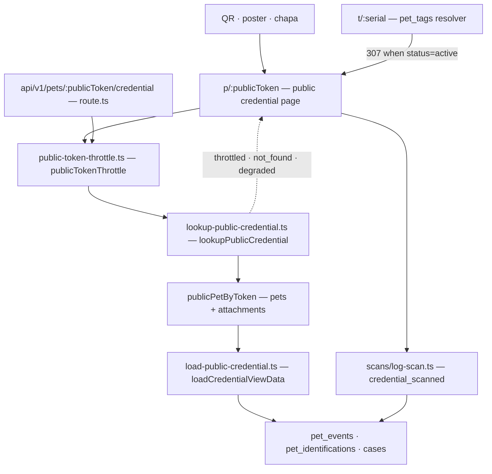

# The public credential

> Snapshot: `c10f4ff03` (`main`) · Facts: `docs/architecture/facts.json` generated 2026-09-02
> Verified against code on 2026-09-02 by writer B (opus subagent) · Status: reviewed
> Numbers in this file are `<!-- fact:key -->` markers checked by `__tests__/architecture-facts.test.ts`.

Invariant 1 of `CLAUDE.md` reads: **the pet is the credential** — a globally-unique
public token that resolves to a QR-verifiable public page. This document is the
engineering reference for that sentence: what the token is, who mints it, what a
scan actually reaches, what each audience is allowed to see, what bounds the read,
and what the credential does NOT do.

Scope: the anonymous surface. Owner, organisation and government surfaces appear
only where they consume or produce a public-credential fact.

---

## 1. The token

`lib/infra/publicToken.ts` is the generator. One shape for every namespace:
`PREFIX-XXXX-XXXX`, two four-character chunks drawn from an alphabet that omits
the character pairs a human confuses when reading a code off a metal tag —
`ALPHABET` at `lib/infra/publicToken.ts:28` drops `0`/`O` and `1`/`I`/`l`.

The draw is rejection-sampled rather than modulo-reduced. `REJECTION_THRESHOLD`
(`lib/infra/publicToken.ts:32`) is the largest multiple of the alphabet length that
fits in a byte; bytes at or above it are discarded and re-rolled
(`lib/infra/publicToken.ts:34-52`). The file states why in its own header: a naïve
`byte % 31` would make the first residues measurably more likely than the last,
and a biased identifier space is a smaller identifier space.

- `generatePrefixedToken(prefix)` — `lib/infra/publicToken.ts:58`, the one primitive.
- `generatePublicToken()` — `lib/infra/publicToken.ts:63`, the pet credential
  (`pets.public_token`), prefix `DIM`. This is the single point where the bare
  codename literal exists; the file carries a `dim-codename-ok` pragma and explains
  that `scripts/check-brand-casing.ts` keys on the hyphen precisely because a
  hyphenated prefix is a public token and a bare one is a leaked codename.
- `generateTagSerial()` — `lib/infra/publicToken.ts:97`, the physical chapa serial.
- `generateTagActivationCode()` — `lib/infra/publicToken.ts:110`. It mints an
  UNPREFIXED `XXXX-XXXX` proof-of-possession code printed on a tag's wrapper,
  stored only as a peppered HMAC (`lib/utils/tag-code-hash.ts`), never in
  plaintext. Deliberately prefix-free: it is a secret, not a namespace.

**Uniqueness is per table, not global.** `lib/infra/publicToken.ts:56` says so:
each prefix has its own unique index, and
there is no cross-table collision check. `pet_tags.serial` carries
`pet_tags_serial_unique` (`db/schema.ts:4711`); the welfare reference code has a
collision-retry loop at the repository layer instead.

**There is more than one generator.** `src/modules/welfare/domain/reference-code.ts:32`
mints `DEN-XXXX-XXXX` with the same alphabet (`:15`) and the same rejection guard
(`:22`) but through Web Crypto rather than `node:crypto`, because the format
validator is imported by a client component. Lens A03 refuted the "ONE generator"
framing explicitly (`dim-interno:docs/reviews/2026-09-fresh/lenses/A03.md`, "Claimed healthy,
not verified"): the security property — a uniform draw, no counter, no timestamp,
no route accepting a raw uuid — holds across all prefixes; the single-implementation
claim does not.

### 1.1 The prefixes, and the redaction mirror

`lib/observability/redact.ts:79` holds `CREDENTIAL_TOKEN_PREFIXES` —
<!-- fact:token_prefixes -->12<!-- /fact --> namespaces, hyphen included, because
the hyphen is what makes a prefix a namespace. Any credential-shaped string in a
client error report is replaced with `[redacted:credential]`
(`lib/observability/redact.ts:180-187`).

The list is transcribed, not imported: `lib/infra/publicToken.ts` pulls in
`node:crypto` and the redactor is bundled into the browser. The file states the
trade and the mitigation at `lib/observability/redact.ts:71-77` — a repo-walking
fence (`lib/observability/redact-prefix-coverage.test.ts`) re-derives the true set
on every run and fails when the two disagree. The same file records that the header comment
in `lib/infra/publicToken.ts` was itself stale by four prefixes when the list was
recounted, which is the argument for the fence rather than for the comment.

A second, independent rule covers URL path segments whose next segment is a bearer
string (`lib/observability/redact.ts:131`). It exists because a token format can
change and because `CG-` care-grant tokens match no credential rule at all.

---

## 2. What a QR encodes, and where it is drawn

The QR is a pure function of one absolute URL. `credentialQrUrl(publicToken)`
(`lib/infra/site-url.ts:58`) returns `${resolveSiteUrl()}/p/${publicToken}`.

`resolveSiteUrl()` (`lib/infra/site-url.ts:45`) reads `NEXT_PUBLIC_SITE_URL`, trims
it, strips a trailing slash, and falls back to `CANONICAL_SITE_URL`
(`lib/infra/site-url.ts:38`) when the value is unset, empty or whitespace-only. The
empty-string case is load-bearing and is documented at `lib/infra/site-url.ts:9-14`:
`??` does not catch a variable that is set to `""`, and the resulting host-less
relative URL produced an unscannable QR on the landing hero in production. Two
sibling surfaces deliberately do NOT use this resolver — `app/sitemap.ts` throws in
production rather than advertise a guessed domain, and `app/layout.tsx` falls back
to localhost (`lib/infra/site-url.ts:21-25`).

Rendering has two implementations, on purpose:

| surface | how the symbol is produced | path |
|---|---|---|
| owner credential, mobile, appointment | `QRCode.create()` in the browser, serialised to one SVG path | `components/ui/CredentialQr.tsx:111` |
| printable chapa sheet | `QRCode.toString({ type: "svg" })` on the server | `app/(app)/mis-mascotas/[publicToken]/chapita/page.tsx:64` |
| lost-pet poster | `QRCode.toString({ type: "svg" })` on the server | `app/(app)/mis-mascotas/[publicToken]/cartel/page.tsx:107` |

`components/ui/CredentialQr.tsx:3-39` records why the client version exists:
`QRCode.create()` is synchronous and pure, so the encode happens in the component
body — no effect, no skeleton, byte-identical SSR and hydration output, and the QR
stops depending on a server round-trip. That is a prerequisite for an offline
credential, not the capability: `public/sw.js` keeps no fetch handler, so the page
still does not load offline. The two print surfaces build the same URL by hand
(`resolveSiteUrl()` plus `/p/${publicToken}`) rather than through
`credentialQrUrl`; the strings are identical today and nothing fences the
duplication. The public credential page itself renders no QR — you arrived by
scanning it.

---

## 3. The routes a token resolves through

- **`app/(public)/p/[publicToken]/page.tsx`** — the HTML surface a camera opens.
- **`app/(public)/t/[serial]/page.tsx`** — the physical-tag resolver. Its state
  table is at `app/(public)/t/[serial]/page.tsx:5-16`: `active` redirects 307 to
  `/p/{token}` (`:103-108`), `unactivated` and `revoked` render a neutral page with
  ZERO pet information, an unknown serial is a 404. The privacy contract at
  `app/(public)/t/[serial]/page.tsx:18-21` is structural — `lookupTagBySerial`
  (`lib/infra/tag-lookup.ts`) projects `{status, publicToken}` and nothing else, so
  there is no pet field available to leak.
- **`app/api/v1/pets/[publicToken]/credential/route.ts`** — the JSON twin for the
  phone. It calls the same door; `app/api/v1/pets/[publicToken]/credential/payload.ts`
  is the only place the two renderings can diverge.
- **`app/(public)/p/[publicToken]/encontre/page.tsx`** and
  **`app/(public)/p/[publicToken]/sighting/page.tsx`** — the two anonymous write
  surfaces hanging off a lost credential.
- **`app/(public)/adoptar/page.tsx`** and its per-pet ficha resolve the same token
  for the adoption listing.

Soft-deleted pets do not resolve on any of them. The filter lives in the query
predicate `publicPetByToken` (`lib/infra/public-pet-lookup.ts`), not in a
post-fetch guard, so an erased subject's row is never read into server memory
(`src/modules/pets/application/read/lookup-public-credential.ts:221-230`).

---

## 4. The one door

`lookupPublicCredential` (`src/modules/pets/application/read/lookup-public-credential.ts:132`)
is the single entry point. It answers a four-way union
(`src/modules/pets/application/read/lookup-public-credential.ts:93`):

| status | meaning |
|---|---|
| `throttled` | over the per-IP read limit; **no pet data was read** |
| `not_found` | the token resolves to nothing, or to a soft-deleted pet |
| `degraded` | a read failed or blew its budget; `pet` is present only when the pet row itself resolved first |
| `ok` | pet row, photo URL, and the full view-data fan-out |

Two properties are the contract rather than the implementation:

1. **Order.** The throttle runs before any pet read
   (`src/modules/pets/application/read/lookup-public-credential.ts:166-173`).
   `__tests__/public-token-throttle-coverage.test.ts` fences guard-before-resolve
   ordering by walking `app/` and `src/` rather than reading a hand list — lens A03
   verified that fence and its ~15 RED-control tests
   (`dim-interno:docs/reviews/2026-09-fresh/lenses/A03.md`, "Healthy — verified solid").
2. **`degraded` is never `not_found`.** A database outage must not answer "this
   token does not exist". Every read is budgeted (`PET_ROW_BUDGET_MS` /
   `VIEW_DATA_BUDGET_MS`, `src/modules/pets/application/read/lookup-public-credential.ts:61-62`)
   and every failure path answers `degraded`.

The limiter arrives as a PORT, not an import
(`src/modules/pets/application/read/lookup-public-credential.ts:70`), because a
use-case must run without a Next request. It is a required parameter, so the type
checker — not a grep over route files — is what stops a caller reaching the pet row
without one. `publicTokenThrottle(bucket)` in `lib/infra/public-token-throttle.ts:305`
is the adapter that binds it to a real request.

---

## 5. Disclosure levels

The code calls them **tiers** in comments and types, and the UI chip on the
credential says **NIVEL**. `app/(public)/p/[publicToken]/page.tsx:659` renders
either `NIVEL 0 · IDENTIDAD` or `NIVEL 2 · DATOS MÉDICOS`; there is no chip for
Tier 1 — the lost state announces itself through the banner instead. The canonical
table is `AGENTS.md` § "Privacy tiers (the public surface)".

| level | who | what resolves | where the gate lives |
|---|---|---|---|
| 0 | anyone scanning | photo, name, species, breed, approximate age by year, sex, credential-valid mark, vaccination boolean, identifier-present boolean, "did you find this pet?" form | default render of `app/(public)/p/[publicToken]/page.tsx` |
| 0+ | same, owner-toggled | an emergency flag ("takes daily medication") with no drug names and no owner phone | `pets.emergency_info_visible` |
| 1 | anyone, but only while `pets.status = 'lost'` | level 0 plus owner first name, phone, e-mail, last-known location — each field independently gated by the owner's `disclose_*_when_lost` column | `src/modules/pets/application/read/load-public-credential.ts:223-443` |
| 2 público | anyone, owner opt-in, time-bounded or permanent | the medical summary streamed into the public page | `src/modules/pets/application/tier2-public/enable-tier2-public.ts:18`, rendered by `app/(public)/p/[publicToken]/Tier2MedicalView.tsx` |
| share link | whoever holds a revocable token | the full libreta sanitaria | `app/libreta/compartir/[shareToken]/page.tsx` |
| counter | a signed-in organisation member with `event.write` | pet identity plus clinical capture, **no owner PII at all** | `app/org/[orgToken]/atender/[publicToken]/page.tsx:1-11` |

Three things follow that are easy to get wrong:

**A signed-in vet sees no more of the public page than a stranger does.** There is
no professional read tier today. `AGENTS.md` lists "Verified vet via portal" as
tier 4, future. What a vet gets instead is `/org/{orgToken}/atender/{publicToken}`:
authorization is `event.write` on their org **plus knowledge of the credential
code** — approximately physical possession — and the surface deliberately exposes
only pet identity and clinical capture, never the owner's name, phone, DNI or
address (`app/org/[orgToken]/atender/[publicToken]/page.tsx:1-11`). To read the
history, the vet needs the owner to share it: a revocable link, or Nivel 2 público.

**Level 1 is fetch-gated, not render-gated — for two fields.** When
`disclosePhoneWhenLost` / `discloseLastLocationWhenLost` are off, the loader
substitutes a SQL `null` literal into the SELECT list
(`src/modules/pets/application/read/load-public-credential.ts:237`, `:281-282`,
`:327`), so the value never leaves Postgres. `profiles.display_name` is NOT
fetch-gated — it is selected unconditionally and narrowed at derivation
(`:374-377`). Lens A03 files that gap as a nit against the file's own comment
(`dim-interno:docs/reviews/2026-09-fresh/lenses/A03.md`, Nits), and records that **no test pins
the SQL projection**: collapsing the conditional branches into a plain `.select()`
would leave the PII one JSX line away with nothing turning red.

**The ownership join is pinned to `role='owner'`.** A pet can hold a second active
`ownerships` row for an accepted temporary caretaker. Without the predicate at
`src/modules/pets/application/read/load-public-credential.ts:259-267` the `limit(1)`
resolved by heap order, and the titular's consent could publish a caretaker's phone
and first name — a third party who never consented. The caretaker's own contact has
its own two-key gate (`lib/infra/caretaker-public-contact.ts`), consulted only when
both the titular's toggle and the caretaker's recorded consent hold
(`:439-442`).

---

## 6. The read throttle

`PUBLIC_TOKEN_READ_LIMIT` (`lib/infra/public-token-throttle.ts:158`) is
<!-- fact:throttle_per_min -->600<!-- /fact --> per minute and
<!-- fact:throttle_per_hour -->6000<!-- /fact --> per hour, per IP, per surface
bucket. The derivation is in the file's own header
(`lib/infra/public-token-throttle.ts:61-157`) and is worth reading before changing
the numbers: Argentine mobile carriers put hundreds of subscribers behind one
public IPv4, so a per-IP counter here is per-gateway, not per-person, and the
previous ceiling refused an ordinary barrio WhatsApp group passing a lost-pet
poster around.

**It fails open.** `lib/infra/public-token-throttle.ts:41-47` states the decision:
the limiter is itself a database write, and the credential is the one page an
anonymous finder in the street depends on, so a degraded database must not make the
limiter the thing that breaks the page before its own degraded render can happen.
Concretely, `isPublicTokenReadThrottled` (`:190`) returns `true` only on a
`RateLimitError`; every other failure is reported through `reportError` and the
request continues (`:202-207`). The reasoning is explicit that this is an abuse
control and not an authorization boundary — nothing behind it is secret from
someone already holding the token.

The port's contract repeats the guarantee rather than delegating it: the door
catches a `RateLimitError` thrown by any adapter and answers `throttled`, and
reports anything else
(`src/modules/pets/application/read/lookup-public-credential.ts:166-173`).

Each surface keeps its OWN bucket, so a per-IP ceiling is additive across them; the
file states the aggregate honestly at `lib/infra/public-token-throttle.ts:103-123`,
including a correction to an earlier paragraph that had overstated it by 2.2×. The
`/api/v1` endpoint additionally carries a per-lookup bucket
(`lib/infra/public-token-throttle.ts:218-248`) that bounds how hard one caller may
hammer ONE credential; the five HTML surfaces deliberately do not
(`:146-153`).

Two residuals are stated in the code rather than hidden:

- `generateMetadata` on `/p/{token}` resolves the token OUTSIDE the guard
  (`lib/infra/public-token-throttle.ts:30-39`), because one HTTP request runs both
  functions and the limiter increments. A throttled caller still causes one
  level-0 metadata read per request. Closing it needs a check-without-increment
  mode that does not exist.
- A distributed walk is untouched by any per-IP figure. Lens A03 records the
  arithmetic and the conclusion (`dim-interno:docs/reviews/2026-09-fresh/lenses/A03.md`).

Routes A03 found with **no** per-IP budget at all: `/refugios/[orgToken]`,
`/r/invite/[token]`, `/perdidas`, `/adoptar` and `/sitemap.xml` (findings A03-3,
A03-G7). None of them resolves a credential token, which is exactly why the
credential-scoped fence cannot see them.

---

## 7. Scan events and their retention

Every view of the public page logs a `credential_scanned` event through
`src/modules/pets/application/scans/log-scan.ts:86`, called from a client component
so the page render stays a pure read. It is a `pet_events` row — the same
append-only spine as everything else — and there is no separate `scan_events`
table (lens A08 says so in as many words:
`dim-interno:docs/reviews/2026-09-fresh/lenses/A08.md`, Coverage).

The privacy contract is at `src/modules/pets/application/scans/log-scan.ts:7-27`:

- Scanner-role rows carry `recorded_by_user_id = NULL` unconditionally, even for a
  signed-in non-owner viewer. `viewer_authenticated` keeps the boolean without the
  identity link.
- `scan_ip_area` is a coarse, city-precision area from platform geo headers
  (`lib/infra/scan-geo.ts`). The raw IP never enters the payload.
- Precise GPS is stored ONLY when the pet is currently lost AND the scanner granted
  browser geolocation. The lost check runs server-side so a forged client call
  cannot attach coordinates to a pet that is not lost.
- Self-scans (owner viewing their own pet) keep the identity and carry **no**
  location fields, because owner-role rows are never purged.

Retention: `SCAN_RETENTION_DAYS` (`lib/infra/scan-retention.ts:43`) bounds the
scanner-role rows, and purging them is what bounds retention of every location
field in the product — they exist nowhere else. The purge is the one narrow
exception carved into the append-only trigger (§8), opened by
`select set_config('app.allow_scan_purge', 'true', true)` inside a transaction
(`lib/infra/scan-retention.ts:76`) and drained in bounded batches
(`lib/infra/scan-retention.ts:111-128`).

Abuse controls on the write: a hard cap plus a one-per-minute dedupe bucket, both
keyed `(token, ip)` (`src/modules/pets/application/scans/log-scan.ts:56-58`,
enforced at `:98`). On a rate-limit hit the scan is dropped silently; on an
infrastructure error it fails open, because a limiter outage must not lose a real
scan.

---

## 8. Append-only, as it applies here

`pet_events` and `case_events` are append-only **by policy, enforced by a database
trigger with an audited override** — never "impossible to modify".
`db/migrations/0127_pet_events_append_only.sql:96-104` binds
`pet_events_no_update` and `pet_events_no_delete`;
`db/migrations/0121_case_events_append_only.sql:70-78` does the same for
`case_events`. The function refuses every mutation
(`db/migrations/0127_pet_events_append_only.sql:90-93`) except two paths:

1. **The general hatch** — `app.allow_event_mutation` plus
   `app.allow_event_mutation_actor` (a uuid). Without the actor the mutation is
   refused outright (`db/migrations/0127_pet_events_append_only.sql:45-48`), and
   every use writes an `audit_log` row (`:50-61`).
2. **The scan purge** — DELETE only, scanner-authored `credential_scanned` rows
   only, older than the retention window only
   (`db/migrations/0127_pet_events_append_only.sql:66-88`, first added by
   `db/migrations/0104_scan_events_retention.sql:74-94`).

Since migration 0235 the override's audit row carries `old` / `new` images
built from an ALLOWLIST (A08-2 — only booleans, uuid-shaped ids, ISO dates,
`*_code` numbers and single-token enum values are copied; every other key is
named in `redacted_keys` without its value, so the audit cannot reverse an
erasure), and the scan-purge
branch is attributed to the system profile `system:cron-scan-retention`
instead of `actor_user_id = null` (A08-6). What stays unreconstructable, on
purpose: the old value of a redacted key. Findings in
`dim-interno:docs/reviews/2026-09-fresh/lenses/A08.md`.

The catalog is <!-- fact:event_types -->55<!-- /fact --> types
(`packages/contract/src/events/event-types.ts:20`). The public credential folds
`event_amended` corrections before rendering, through
`lib/domain/credential-badges.ts` — a stranger scanning the QR sees the corrected
clinical value, never the superseded one, and the phone reads it identically
because both surfaces are fed by the same array built at
`src/modules/pets/application/read/load-public-credential.ts:177`.

---

## 9. Lost, found, and the return handshake

Marking a pet lost is `setPetLostWriter`
(`src/modules/events/application/lifecycle/set-pet-lost-use-case.ts:106`). In one
transaction it opens a `lost_pet_episode` case (`:195-215`), appends a
`status_changed` event carrying the disclosure-preferences snapshot (`:217-224`),
and dual-writes the status plus the five disclosure columns onto `pets`
(`:243-261`). The broadcast is post-transaction and best-effort (`:374-399`).

What the broadcast is: an in-app notification fan-out to members of **verified
organisations whose coverage matches the pet's jurisdiction**
(`lib/infra/lost-pet-broadcast.ts:1-15`). The body is PII-free by design and the
call to action links to the public credential, where the owner's disclosure
preferences govern what is visible. It is not a public alert, not an SMS, and not
an e-mail.

Three anonymous write paths hang off a lost credential, each rate-limited by
`(token, ip)` at 1/min and 10/hr:

| what the finder is saying | entry point | what it writes |
|---|---|---|
| "I saw this pet here" | `src/modules/pets/application/sighting/report-pet-sighting.ts` | a `note_added` sighting event + notification |
| "I have this pet, come get it" | `app/(public)/p/[publicToken]/encontre/action.ts:53` (limiter at `:162`) | a `note_added` event with `kind="finder_in_possession"`, an attachment, and an urgent notification |
| "I found this pet" (lighter) | `src/modules/pets/application/public/notify-owner-of-found-pet.ts:65` (limiter at `:100`) | **no event and no case — only a notification** |

The third is worth naming because its own header does
(`src/modules/pets/application/public/notify-owner-of-found-pet.ts:23-40`): the
notification is the whole circuit, so the write goes through
`createNotificationsBulk` (`:197-210`) which supplies a dead-letter and an
idempotency key. The finder always reads "listo", including on a failure — the
honesty lives in the dead-letter, not in the copy. Recipients are ranked
(`lib/infra/pet-alert-recipients.ts`, called at `:158`): titular first, then the
institution holding custody, with active caretakers as concurrent recipients.

When the pet is in a custody dispute the found-report action refuses and redirects
the finder to the neutral tip form
(`src/modules/pets/application/public/notify-owner-of-found-pet.ts:140-145`), whose
submission lands on the dispute case for the reviewing authority only
(`src/modules/custody-disputes/application/report-dispute-tip.ts`). The gate is
server-side, not a hidden button.

**The devolución handshake** is a separate, authenticated module:
`src/modules/return-to-owner/`. A vecino or refugio holding custody proposes a
return (`src/modules/return-to-owner/application/propose-return-as-vecino.ts:15`),
which requires an active `shelter_custody` ownership row (`:41-55`), refuses when
another proposal is pending, and serialises concurrent proposals on the pet's
advisory lock (`:96-105`); the owner accepts or rejects
(`src/modules/return-to-owner/application/owner-accept-return.ts`,
`src/modules/return-to-owner/application/owner-reject-return.ts`). The owner side
lives at
`app/(app)/mis-mascotas/[publicToken]/devolucion/page.tsx`. An erased pet answers
like a token that never existed (`:29-31`).

`src/modules/pets/application/chip-match/confirm-chip-match-vecino.ts` is the
adjacent path for a finder who reads a microchip rather than a QR.

---

## 10. Physical tags

`pet_tags` (`db/schema.ts:4681`) is the chapa. Columns worth naming: `serial` (the
`TAG-XXXX-XXXX` value engraved with the QR, uniquely indexed at `db/schema.ts:4711`),
`activation_code_hash` (an HMAC of the wrapper code, never SELECTed by app code —
the evidence gate compares inside a SQL predicate,
`db/schema.ts:4686-4688`), and a three-state machine — `unactivated`, `active`,
`revoked` — enforced as a CHECK constraint rather than by convention
(`db/schema.ts:4722-4727`).

The resolver is jurisdiction-blind on purpose
(`app/(public)/t/[serial]/page.tsx:23-25`): a shipped tag must keep resolving even
if a jurisdiction later disables the distribution channel. Note that the engraved
channel starts OFF by default and is opened by a jurisdictional rule
(`lib/infra/physical-credential-channels.ts`); the self-printed QR sheet is the
universal one.

`/t/[serial]` carries its own bucket at 100 per minute
(`app/(public)/t/[serial]/page.tsx:89`) — a single window, unlike the credential
surfaces. Lens A03 examined that as a finding and **refuted** it: the convention it
was said to break does not exist (`dim-interno:docs/reviews/2026-09-fresh/lenses/A03.md`,
Refuted, A03-4).

Cache policy: `/t/` is `force-dynamic` but is NOT in the `no-store` allowlist
(`lib/infra/public-cache-policy.ts`), which is finding A03-1 — a revoked chapa's
previous 307 may be retained by a shared cache. Bounded, because the redirect
target is `no-store` and 404s for an erased pet.

---

## 11. What the public credential does not do

State these rather than soften them.

- **No Mi Argentina federation.** It is the architectural premise
  (`CLAUDE.md` invariant 6) and an env-gated stub: `lib/infra/miarg-oidc.ts` throws
  "not implemented", no account holds a Mi Argentina identity, and the callback
  answers 404 when the integration is disabled. See
  `dim-interno:docs/reviews/2026-09-fresh/DECK-FACTS.md` §4.
- **No RENAPER check.** DNI is self-declared. `lib/utils/dni-hash.ts` is the only
  handling; the schema holds a hash and the last four digits and no plaintext.
- **No SENASA notification.** The export engine exists; there is no screen and no
  batch notification (`dim-interno:docs/reviews/2026-09-fresh/DECK-FACTS.md` §4).
- **No "claim your pet by DNI" flow.** Disabled by a hard constant in
  `src/modules/pets/application/stub-claim/claim-stub-profile.ts`, held pending
  identity verification.
- **No crash reporting on the web.** Sentry is mobile-only; the web-side redaction
  seam in `lib/observability/redact.ts` is wired server-side through the error sink.
- **No storage retention job.** Nothing garbage-collects replaced photos or orphaned
  uploads (`docs/architecture/privacy-known-limitations.md`, and A07-6).
- **No offline credential.** The client-side QR encode is a prerequisite, not the
  capability (`components/ui/CredentialQr.tsx:12-15`).
- **The public page is not an authorization boundary for the person holding the
  token.** Everything on it is public to whoever scanned it; the throttle is a cost
  control (`lib/infra/public-token-throttle.ts:44-47`).

Two open findings that touch this surface directly, both from the 2026-09 audit
(`dim-interno:docs/reviews/2026-09-fresh/SYNTHESIS.md`): `pet_events.author_role` is forgeable
through PostgREST (A02-1, queued as migration 0212 — an owner could post an event
that falsely claims a professional signature, which the credential's confidence
badge reads), and anonymous writes carry no IP-less per-token cap (A03-2).

---

## 12. Attachments reachable from a credential

Photos on `pet-photos` are a public bucket and their URLs are built
deterministically (`lib/infra/storage.ts:24-27`). Everything clinical or
evidentiary is private and served as a short-lived signed URL generated server-side
as service role: <!-- fact:signed_url_ttl_seconds -->3600<!-- /fact --> seconds for
both `event-attachments` and `welfare-evidence` (`lib/infra/storage.ts:21-22`).

No signer in that module takes a caller client, and the file says why
(`lib/infra/storage.ts:1-8`, `:73-93`): an authenticated-role SELECT on a private
bucket is an enumeration grant, not an access check. The consequence for a new call
site is stated bluntly — calling the signer is equivalent to handing out the file,
so authorization must already have happened.

---

## Sources

- Code at `c10f4ff03`, every path and line above opened at that SHA.
- `dim-interno:docs/reviews/2026-09-fresh/lenses/A03.md` — public and unauthenticated surface abuse.
- `dim-interno:docs/reviews/2026-09-fresh/lenses/A08.md` — event-ledger integrity.
- `dim-interno:docs/reviews/2026-09-fresh/DECK-FACTS.md` — refuter-surviving positives and the "do not draw" list.
- `docs/architecture/privacy-known-limitations.md`, `AGENTS.md` § Privacy tiers.
