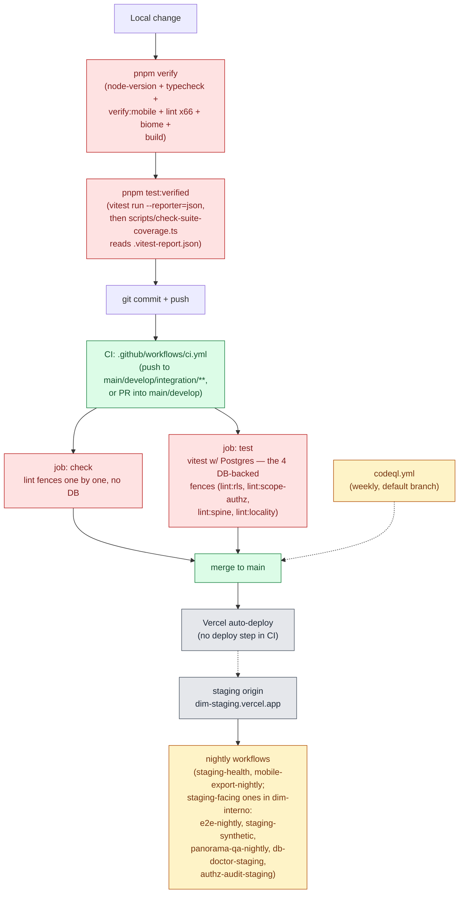

# Quality pipeline — gates, fences, CI and deploy

> Snapshot: `c10f4ff03` (`main`) · Facts: `docs/architecture/facts.json` generated 2026-09-02
> Verified against code on 2026-09-02 by writer D (sonnet subagent) · Status: reviewed
> Numbers in this file are `<!-- fact:key -->` markers checked by `__tests__/architecture-facts.test.ts`.

This is the honest map of "how do we know it works": what runs before a commit,
what runs in CI, what runs nightly against staging, and what does not run at
all yet. It does not claim more than each gate actually checks — see
`dim-interno:docs/presentation/2026-09-oficiales/12-calidad-y-auditoria.md` for the
Layer B version of the same claim, written for an official.

## 1. The gate chain

`e2e` (Playwright) is **not** in this chain — see §5. It is CI's own nightly
job, run against the deployed staging origin, not the local suite.

## 2. `pnpm verify` — what actually runs

`package.json`'s `verify` script is one `&&`-chained line:
`lint:node-version` → `typecheck` (`tsc --noEmit`) → `verify:mobile` → `lint`
(Biome, over `.` and `app/.well-known`) → <!-- fact:verify_fences -->81<!-- /fact -->
distinct `pnpm lint:<key>` fence steps → `build`
(`node scripts/build.mjs`) → two more lint steps that run after the build
(`lint:csp-prerender`, `lint:route-weight`, which need the built output).

The fence count is generated two ways and cross-checked:
<!-- fact:lint_scripts -->81<!-- /fact --> keys in `package.json` start with
`lint:`, and <!-- fact:verify_fences -->81<!-- /fact --> of them are actually
invoked inside the `verify` script string. `pnpm lint:ci-parity`
(`scripts/check-ci-lint-parity.ts`) is what keeps those two numbers equal — a
`lint:*` key that exists but is missing from `verify` is a fence nothing runs,
and this fence is the one that would catch that drift. Not every fence is a
`lint:*` script: <!-- fact:check_scripts -->88<!-- /fact --> files under
`scripts/check-*.ts` exist (three siblings — `check-raw-buttons.mjs`,
`check-raw-select.mjs`, `check-op-controls.mjs` — are plain `.mjs` and are
wired into `lint:buttons`, `lint:select`, `lint:op-controls`, so the `.ts`
count and the `lint:*` count are close but not identical by construction).

`verify:mobile` is a nested chain, not a single check: `pnpm --filter mimar
typecheck && pnpm --filter mimar test && pnpm --filter mimar exec expo config
--type public` — the Expo app's own `tsc`, its own Jest suite
(<!-- fact:mobile_jest_files -->143<!-- /fact --> files, §4), and a config
resolution smoke check.

### Fence categories (representative, not exhaustive)

`pnpm verify`'s <!-- fact:verify_fences -->81<!-- /fact --> fences group into
recognisable categories. These twelve are representative, one per category —
the full list is `package.json`'s `lint:*` keys:

| Category | `lint:*` key | Script | What it fails on |
|---|---|---|---|
| Authorization | `lint:authz` | `scripts/check-authz-guards.ts` | an exported route/action handler with no recognised auth guard and no `@no-auth-required: <reason>` |
| RLS | `lint:rls` | `scripts/check-rls-coverage.ts` | a public table missing `ENABLE ROW LEVEL SECURITY`, or a table reclassified without an explanation (DB-backed — runs in CI's `test` job, not `check`) |
| API contract | `lint:api-v1` | `scripts/check-api-v1-envelope.ts` | a `/api/v1` route that builds `NextResponse.json(` by hand instead of the shared `apiV1Json`/`apiV1Error` helper, or an unnamed rate-limit bucket literal |
| Cost / DB budget | `lint:db-budget` | `scripts/check-db-budget.ts` | a registered route glob whose handler calls neither a budget wrapper (`withDbBudget`/`loadWithTimeout`) nor a named `DELEGATING_ROUTES` entry |
| Design system | `lint:tokens` | `scripts/check-design-tokens.ts` | a raw Tailwind palette utility or a `dark:` prefix reintroduced outside the token layer |
| Brand | `lint:brand` | `scripts/check-brand-casing.ts` | `MiMAR`/`Mimar`/`DIM`-as-brand in UI-facing copy — the public brand is lowercase `miMAR` |
| Audit trail | `lint:audit-log` | `scripts/check-audit-log-coverage.ts` | an operator action that mutates state and writes no `audit_log` row |
| Data integrity | `lint:locality` | `scripts/check-locality-integrity.ts` | a jurisdiction field accepting free text instead of the canonical `ar_localities` catalog (DB-backed) |
| Public/private boundary | `lint:public-boundary` | `scripts/check-public-boundary.ts` | a `docs/` file outside the declared public categories, a path shaped like private material (`reviews/`, `handoff/`, `cutover-*`, …), a personal mailbox, an e-mail + password pair in docs/config, or a tracked `.env*` with a value — policy in `docs/agents/public-private-boundary.md` |
| CI hygiene | `lint:ci-parity` | `scripts/check-ci-lint-parity.ts` | a `lint:*` key present in `package.json` but absent from either `verify` or `ci.yml` |
| Scheduling correctness | `lint:sched-refs` | `scripts/check-scheduled-fence-refs.ts` | a `schedule:`-triggered workflow with no explicit `ref:`, which would silently check out the default branch instead of the deploy branch (the bug documented in `dim-interno:.github/workflows/e2e-nightly.yml` and `mobile-export-nightly.yml`, §4) |
| Environment pinning | `lint:node-version` | `scripts/check-node-version.ts` | `.nvmrc`, `.node-version`, `package.json engines.node` and the CI `setup-node` step disagreeing on the Node version |
| ID hygiene | `lint:uuid` | `scripts/check-uuid-literals.ts` | a hardcoded UUID literal outside a test fixture |

Two DB-backed fences worth naming because they run nowhere else: `lint:rls`
and `lint:locality` (plus `lint:scope-authz` and `lint:spine`) need Postgres
and are the reason CI splits into a `check` job (no DB, most of the <!-- fact:verify_fences -->81<!-- /fact --> fences)
and a `test` job (real Postgres, these four plus the vitest suite) — see §4.

## 3. `pnpm test:verified` vs `pnpm test` — the Definition of Done

`CLAUDE.md`'s Definition of Done is explicit that these are not
interchangeable, and quotes why in full:

> **Not `pnpm test`.** Its exit code lies in both directions, and the repo
> says so in `scripts/check-suite-coverage.ts`: a worker dying mid-run takes
> its whole FILE with it, and the summary still reads like a pass —
> `1333 passed | 1 skipped (1336)` is a green-looking line with two files that
> never executed. `test:verified` runs the same suite, ignores vitest's exit
> code on purpose, and fails when any discovered file is missing from the
> report. Never give it a positional file filter; it detects that and skips
> the verdict loudly.

The script is `scripts/run-verified-suite.ts` (invoked by `pnpm test:verified`),
and the header of that file records exactly why it is a script and not a
`package.json` one-liner: the original form used a POSIX `;` to force the
coverage check to run even when vitest exits non-zero (`;` is load-bearing —
`&&` would skip the verdict on the runs that need it most), and `;` is not a
separator under Windows' `cmd.exe`, so on Windows the entire tail silently
became arguments to vitest and the coverage check never ran. Found 2026-08-09:
a local run reported success while 887 of 1225 test files had never reported.
The verdict itself is rendered by `scripts/check-suite-coverage.ts`
(`pnpm check:suite-coverage`), which reads the JSON report
(`.vitest-report.json`) `run-verified-suite.ts` writes.

**What counts as passing, exactly** (quoted from `CLAUDE.md`, verbatim — this
project has already been burned by a paraphrase softening this):

> - `reported N file(s); N discovered; 0 failing test(s); 0 broken file(s)` →
>   **passes.** Every file ran and nothing failed.
> - Any file short, any failing test, or any broken file → **fails.** No
>   judgement call, no re-roll to get a nicer number.

**The three red signatures `CLAUDE.md` documents, plus one closed test defect, and the rule for each:**

1. **Broken file (mock/collection/import error).** A file reports with an
   error outside any test — zero failing tests, the file simply never ran.
   May not be committed.
2. **Broken file (pending assertion — the worker-crash signature).** The
   worker dies mid-file; the file reports `passed` with assertions still
   `pending`. Rule: **re-run once.** A clean re-run whose victim is unrelated
   to the change = the open worker defect, committable with both verdict
   lines quoted. A reproducing failure, or a victim inside the change's blast
   radius, is treated as the change's own failure.
3. **Host-vs-Postgres clock drift.** An assertion comparing a `new Date()`
   read on the host against a column defaulted from Postgres' `now()` inside
   Docker — the container clock can sit behind the host without warning. No
   assertion may make that comparison; take the instant from the database
   (`__tests__/_helpers/db-now.ts`) or drop the window and match on payload.
   This is never committable and never re-run-able — a suite that answers
   differently twice over one tree does not meet the Definition of Done.
4. **Teardown crash.** The verdict line is clean
   (`0 failing test(s); 0 broken file(s)`) but `run-verified-suite` still
   exits 1 because vitest itself exited 1, with `Worker exited unexpectedly`
   in the log — an open, unfixed defect in vitest 4.1.6 where a run-level
   crash is dropped by the JSON reporter. This is the **only** red signature
   that may be committed as-is, stated in the commit with the verdict line
   quoted.

`CLAUDE.md` also documents a **fifth, environmental** signature specific to a
fresh git worktree: the six `__tests__/rls/*` files report BROKEN with
credential-shaped errors because a fresh worktree has no `.env.local` (it is
gitignored) — cured with `supabase status -o env` before treating a worktree
gate as evidence of anything.

## 4. What the suite actually covers

- <!-- fact:vitest_files -->1720<!-- /fact --> files Vitest discovers
  (`vitest.config.ts` → `__tests__/db-reachability.ts`'s
  `discoverTestFiles()` — the exact set Vitest runs, not an independent glob
  that could drift from it).
- <!-- fact:mobile_jest_files -->143<!-- /fact --> files under
  `apps/mobile/src/**/*.test.ts(x)`, run by a **separate** runner
  (jest-expo, via `verify:mobile`) — `db-reachability.ts` skips `apps/` for
  exactly that reason, so these are never double-counted with the vitest
  total.
- <!-- fact:e2e_specs -->45<!-- /fact --> files under `e2e/**/*.spec.ts`.
  Playwright's own `testIgnore` drops `demo/**` and `perf/**` at run time, so
  fewer than <!-- fact:e2e_specs -->45<!-- /fact --> run in the default
  project.

## 5. e2e is a separate gate

Playwright is **not** in `pnpm verify` and is **not** in `pnpm test:verified`
— `e2e/README.md` opens by describing it as browser-level tests against the
**built** app (`next build && next start`), a different runtime than the
vitest suite's mocked/DB-integration tests. It runs two ways:

- Locally, on demand: `pnpm e2e` (shorthand for `playwright test`).
- In CI, as its own nightly job — `dim-interno:.github/workflows/e2e-nightly.yml`
  (scheduled from the private companion repository since 2026-09-24; it checks
  this repository out and runs the suite from it),
  `on: schedule` (`0 6 * * *` UTC = 03:00 ART) plus `workflow_dispatch`,
  against the deployed staging origin.

**The E2E job's own history is worth stating plainly, because it is the
clearest documented case of a gate lying by omission.** The workflow's header
records that it failed **every run it ever had — 20 of 20, 2026-08-08 through
2026-08-27** — because a route rename (`/login` → `/iniciar-sesion`, a 308)
broke a login helper's redirect check, and a `schedule:`-triggered workflow
checks out the **default branch** while staging then deployed from
`integration/all-*`: the fix had already landed on the integration branch
(`63c093065`, 2026-08-10) but the nightly kept grading `main`, which was
weeks behind. `scripts/check-scheduled-fence-refs.ts` (`lint:sched-refs`) now
fences every `schedule:`-triggered workflow for a missing explicit `ref:` so
this class cannot recur silently.

Whether the E2E job is *currently* reliable in the test-practice sense — real
browser vs API-only seams, cleanup discipline, no hardcoded fixtures — has not
been independently audited: lens **C09 (e2e practice)** in the 2026-09-fresh
audit is listed **DEFERRED lote 2** in `dim-interno:docs/reviews/2026-09-fresh/BACKLOG.md:281`
and in `dim-interno:docs/reviews/2026-09-fresh/README.md`. The row itself flags that
`e2e/demo/_db-cleanup.ts` changed materially after the (other) lenses ran, so
even a future C09 pass would need to read that file at HEAD. Until C09 runs,
"the e2e gate is trustworthy in the way its green result implies" is tracked
as an open question, not a closed one — this is stated here rather than in
engram because the finding already has a durable home in the audit's own
backlog.

## 6. CI workflows

<!-- fact:ci_workflows -->4<!-- /fact --> files under `.github/workflows/*.yml`:

| Workflow | Trigger | What it runs |
|---|---|---|
| `ci.yml` | `push` to `main`, `develop`, `integration/**`; `pull_request` into `main`/`develop` | Two jobs. `check` (no DB): `lint:node-version`, Biome, then the non-DB fences one at a time (`lint:tokens`, `lint:token-parity`, `lint:authz`, `lint:audit-log`, …), kept in parity with `pnpm verify` by `lint:ci-parity`. `test`: the vitest suite with a real Postgres, which is where the four DB-backed fences (`lint:rls`, `lint:scope-authz`, `lint:spine`, `lint:locality`) actually run — they would silently skip in `check`. |
| `codeql.yml` | `schedule` (weekly) + presumably `push`/`pull_request` (SAST) | CodeQL static analysis over the JS/TS sources, no build step needed. Deliberately scans the **default branch** (`main`) rather than an integration branch — the one scheduled workflow that does NOT pin an integration `ref:`, because CodeQL attributes findings to the ref that triggered the run, and attributing a finding to code that is not on `main` would poison the Security tab's baseline. |
| `mobile-export-nightly.yml` | `schedule` | Bundles the Expo client the way a release would (Metro export), to catch a bundling regression on a schedule rather than at release time. Also pins an explicit `ref: main` (the scheduled-fence rule). |
| `staging-health.yml` | `schedule`, cron `*/15 * * * *` | `health-poll` (~every 15 min, no checkout, no secret — `curl` + `jq` against `/api/health`). |

**Staging-facing scheduled jobs live in the private companion repository**
(`dim-interno:.github/workflows/`, since 2026-09-24): `e2e-nightly.yml`
(Playwright against staging, §5), `staging-synthetic.yml` (the daily
`e2e/synthetic-monitor.spec.ts` battery that used to be `staging-health.yml`'s
second job), `db-doctor-staging.yml` and `authz-audit-staging.yml` (read-only
audits of the staging database), and `panorama-qa-nightly.yml` (report-only QA
harnesses against a local stack). They need staging secrets, or produce
internal reports, so they are scheduled from there: each checks this repository
out (`repository: ignaciodelvalle/mimar`, `ref: main`) and runs the same
commands, and their red-streak alerts open issues there. `lint:sched-refs`
scans only this repository's workflows.

## 7. Deploy

**There is no deploy step inside `ci.yml`.** Vercel auto-deploys on every push
to the branch it is linked to (`main`) — a Vercel-platform behaviour, not a
CI job this repo defines. `pnpm run deploy:staging` is a **local, manual**
script (`package.json`): `pnpm verify && tsx scripts/migrate.ts && npx vercel
--prod --archive=tgz` — it re-runs the full gate, runs pending DB migrations
against the target database, then pushes a production Vercel deploy. It is
distinct from CI's own auto-deploy trigger and is the path used to push a
migration alongside code.

Mobile builds are separate: `apps/mobile/eas.json` declares three EAS build
profiles — `development` (internal distribution, Expo dev client, APK),
`preview` (internal distribution, APK) and `production` (store distribution,
Android App Bundle, `autoIncrement: true`). None of the three is wired into
`ci.yml`; `mobile-export-nightly.yml` runs a Metro bundle export as a
regression check, not an EAS build.

## 8. The doc fences

Four fences keep this documentation layer itself honest — none of them is a
"testing the app" fence, all four test the docs:

| Fence | Guards |
|---|---|
| `__tests__/architecture-facts.test.ts` | `docs/architecture/facts.json` matches a fresh run of `scripts/architecture-facts.ts`; every `<!-- fact:key -->` marker in `docs/architecture/**` and `dim-interno:docs/presentation/**` (once it exists) names a real key and states its exact value; every backticked repo path in those trees exists on disk (with a small, audited historical-path allowlist). This is the fence every file in this doc pack is written against. |
| `__tests__/conventions-canon-parity.test.ts` | `docs/architecture/conventions-canon.md` (and its per-scope pages) is a byte-for-byte render of `docs/architecture/conventions-canon.json` — not just matching verdicts, the full rule text, source quote and basis, so a hand edit anywhere in the rendered output turns this red. |
| `__tests__/event-catalog-count.test.ts` | Every currently-authoritative doc that states the event-type count in prose agrees with `EVENT_TYPES.length`, and that the `AGENTS.md` heading's GitHub anchor slug (`#event-catalog--N-types`) matches every link that points at it — a heading and a slug can drift independently of each other. |
| `__tests__/encoding-fitness.test.ts` | No tracked source file contains the classic UTF-8-read-as-CP1252 mojibake pattern or a literal replacement character, and no CODE/DATA file (docs are exempted, since prose legitimately quotes the bug) carries an invisible U+00AD soft hyphen. |

## 9. The conventions canon

`docs/architecture/conventions-canon.md` renders
`docs/architecture/conventions-canon.json`:
<!-- fact:canon_rows -->527<!-- /fact --> rows, harvested from the project's
own prose (`AGENTS.md`, `CLAUDE.md`, fence headers, `docs/agents/` briefs,
`docs/architecture/`, `e2e/README.md`, `CONTRIBUTING.md`, test-file comment
blocks) and classified against whether the enforcer they cite can actually
FAIL on a violation:

- <!-- fact:canon_enforced -->185<!-- /fact --> **ENFORCED** — a fence or test
  fails on a violation.
- <!-- fact:canon_partial -->94<!-- /fact --> **PARTIAL** — some but not all
  of the rule's surface is covered.
- <!-- fact:canon_unenforced -->248<!-- /fact --> **UNENFORCED** — the rule is
  stated in prose with no enforcer that can fail on it.

That last number is the honest one: fewer than half of the conventions this
project states about itself have a fence that can catch a violation. This is
not this doc's territory to change — `docs/architecture/conventions-canon.md`
and `conventions-canon.json` are generated files, out of scope for this doc
pack.

## 10. Related

- `docs/architecture/README.md` — the doc-map this file belongs to.
- `docs/architecture/api-invariants.md` — the merge checklist and the fences
  that check it (§9 of that file) for one specific surface, `/api/v1`.
- `docs/architecture/rls-coverage.md` — RLS as a backstop layer, not a gate;
  the DB-backed `lint:rls` fence is one input to it, not the whole picture.
- `dim-interno:docs/presentation/2026-09-oficiales/12-calidad-y-auditoria.md` — the
  Layer B version of this file: "cómo sabemos que funciona", scoped for a
  municipal official rather than an engineer.
