# System context — actors, external systems, runtime topology, portals

> Snapshot: `c10f4ff03` (`main`) · Facts: `docs/architecture/facts.json` generated 2026-09-02
> Verified against code on 2026-09-02 by writer A (opus subagent) · Status: reviewed
> Numbers in this file are `<!-- fact:key -->` markers checked by `__tests__/architecture-facts.test.ts`.

This is the C4 level-1 view of DIM / miMAR: who talks to the system, what the
system talks to, where it runs, and which portal a request lands in. It is the
entry point for `docs/architecture/data-model.md` (what is stored),
`docs/architecture/mobile-contract.md` (how the phone talks to it) and
`docs/architecture/api-invariants.md` (what a `/api/v1` handler owes).

Nothing here is aspirational. Where an integration does not exist, it is drawn
as a stub and named as one — the three that matter are Mi Argentina, RENAPER and
a SENASA notification channel, and all three are absent from the running system.

---

## 1. Actors

| Actor | Enters through | Identity | What the system lets them do |
|---|---|---|---|
| **Titular** (owner) | `app/(app)` on the web, or the Expo app in `apps/mobile` | Supabase Auth session; DNI is self-declared and stored only as a hash plus the last four digits (`lib/utils/dni-hash.ts`) | Register a pet, hold its credential, record events, transfer titularidad, exercise Ley 25.326 rights |
| **Vecino/a** (neighbour / finder) | `app/(public)` — no account required | None. The public credential resolves from the token alone | Scan a `DIM-XXXX-XXXX` code, read the disclosure-gated credential page, report a sighting, file a welfare denuncia |
| **Veterinario/a** | `app/(app)` for a solo professional, `app/org/[orgToken]` when acting for a clinic | Supabase Auth + `profiles.role` + `organization_memberships` | Record clinical events on the append-only spine, run agenda and turnos |
| **Refugio** (shelter) | `app/org/[orgToken]` | Organization membership plus capability grants (`ORGANIZATION_CAPABILITIES`, `db/schema.ts:206`) | Intake, custody, adoption listing and review, foster |
| **Autoridad local** (municipality) | `app/gob` | `profiles.role = 'govt'` plus jurisdiction assignments (`govt_assignments`) | Jurisdiction-scoped case work, denuncia moderation, census, KPI dashboards, exports |
| **Administración de la plataforma** | `app/admin` | `profiles.role = 'admin'` | Universal scope: accounts, organizations, rules console, outbox, system health |

Two properties of this table are load-bearing and are stated rather than
implied:

- **Identity is self-declared.** There is no RENAPER lookup anywhere in the
  repo. A DNI entered at registration is hashed and never verified against a
  national register. `docs/architecture/privacy-known-limitations.md` is the
  register of what that costs and what was accepted.
- **Role and account type are read from `profiles`, not from the JWT.** That is
  why the write surface on `profiles` was closed outright in
  `db/migrations/0211_profiles_lock_postgrest_writes.sql` — see §6.

---

## 2. Context diagram (C4 level 1)

```mermaid
graph TB
  subgraph people[Actors]
    titular[Titular]
    vecino[Vecino/a]
    vet[Veterinario/a]
    refugio[Refugio]
    gob[Autoridad local]
    admin[Administracion]
  end

  subgraph dim[DIM / miMAR]
    web[Next.js 15 App Router<br/>app/]
    api[api/v1 bearer surface<br/>app/api/v1]
    mobile[Expo Android app<br/>apps/mobile]
    contract[packages/contract<br/>wire truth]
  end

  subgraph ext[External systems]
    pg[(Supabase Postgres<br/>RLS backstop)]
    gotrue[Supabase Auth / GoTrue]
    storage[Supabase Storage<br/>pet-photos, attachments, evidence]
    vercel[Vercel functions + cron<br/>region gru1]
    eas[EAS Build / Google Play]
    nominatim[Nominatim / OSM<br/>server-side proxy only]
    push[Web Push VAPID]
    sentry[Sentry<br/>mobile only]
  end

  subgraph stubs[Declared, not built]
    miarg[Mi Argentina OIDC]
    renaper[RENAPER]
    senasa[SENASA notification]
  end

  titular --> web
  titular --> mobile
  vecino --> web
  vet --> web
  refugio --> web
  gob --> web
  admin --> web

  mobile --> api
  mobile --> gotrue
  mobile --> contract
  web --> contract
  api --> contract

  web --> pg
  api --> pg
  web --> gotrue
  web --> storage
  web --> nominatim
  web --> push
  web --> vercel
  mobile --> sentry
  mobile --> eas

  web -.-> miarg
  web -.-> renaper
  web -.-> senasa

  classDef truth fill:#dcfce7,stroke:#15803d,color:#14532d;
  classDef control fill:#fee2e2,stroke:#b91c1c,color:#7f1d1d;
  classDef derived fill:#fef3c7,stroke:#b45309,color:#78350f;
  classDef external fill:#e5e7eb,stroke:#4b5563,color:#1f2937;
  classDef stub fill:#f9fafb,stroke:#6b7280,color:#374151,stroke-dasharray:6 4;

  class pg truth
  class gotrue,storage,vercel,eas,nominatim,push,sentry external
  class miarg,renaper,senasa stub
```

---

## 3. External systems, one row each

| System | Reached from | Path that proves it | Notes |
|---|---|---|---|
| **Supabase Postgres** | Next.js server (Drizzle), and PostgREST for the anon key | `db/rls.sql`, `docs/architecture/rls-coverage.md` | The Drizzle connection is the `postgres` role with `BYPASSRLS`; RLS is the backstop over the PostgREST surface only |
| **Supabase Auth (GoTrue)** | Web via cookies, phone via the SDK directly | `lib/supabase/middleware.ts`, `apps/mobile/src/auth/supabase-auth.ts` | The phone's Supabase client refreshes the token and nothing else |
| **Supabase Storage** | Server-side signers only | `lib/infra/storage.ts` | `pet-photos` and `org-logos` are public buckets; `event-attachments` and `welfare-evidence` are private and served through signed URLs with a TTL of <!-- fact:signed_url_ttl_seconds -->3600<!-- /fact --> seconds |
| **Vercel** | Hosts the whole Next.js app and every cron | `vercel.json` | `regions: ["gru1"]` — São Paulo; function `maxDuration` is 60 s, 300 s for the cube refresh |
| **EAS Build / Google Play** | Builds and ships the Android binary | `apps/mobile/eas.json`, `apps/mobile/app.config.ts` | Profiles `development`, `preview`, `production`; the last is `app-bundle` + store distribution |
| **Nominatim / OSM** | Server-side geocoding proxy | `lib/infra/geocoding.ts`, `app/actions/geocoding.ts` | Never called from the browser; never logs the query string (spec D10, stated at `lib/infra/geocoding.ts:7`) |
| **Web Push (VAPID)** | Best-effort second delivery leg for urgent notifications | `lib/infra/web-push.ts` | Feature-flagged; a no-op unless the kill switch and both VAPID keys are set. The `notifications` table stays the source of truth |
| **Sentry** | **Mobile only** | `apps/mobile/src/observability/sentry.ts` | `sendDefaultPii: false`, `tracesSampleRate: 0`. The **web has no crash reporter at all** — a client error dies in the visitor's tab (`docs/architecture/client-error-sink-pending-decision.md`) |

### 3.1 The three stubs

Drawn hatched in every diagram in this pack, because the difference between
"planned" and "present" is exactly what an official is entitled to know.

- **Mi Argentina** — an OIDC seam exists and is *closed by default*.
  `lib/infra/miarg-oidc.ts:34-37` gates on four env vars being present; when they
  are absent, `app/auth/miarg/callback/route.ts` returns 404. The route's own
  comment says "Set `MIARG_OIDC_*` env vars only after the real implementation
  lands" (`app/auth/miarg/callback/route.ts:54`). Federation is invariant #6 of
  `CLAUDE.md` — a premise the architecture must not harm, not a shipped feature.
- **RENAPER** — no module, no route, no env var, no call site. Identity is
  self-declared, full stop.
- **SENASA** — there is an **export** (`lib/analytics/senasa-export.ts`,
  `lib/analytics/senasa-export-query.ts`) and a sanitary vocabulary
  (`lib/reference/sanitary-vocab.ts`). There is **no notification channel**: the
  system does not tell SENASA anything, and nothing in the repo listens for a
  SENASA reply.

---

## 4. Runtime topology

The whole system is one Next.js 15 application deployed to Vercel functions,
plus a Postgres/Auth/Storage project at Supabase, plus an Expo Android binary
built by EAS.

### 4.1 Regions — what is stated in the repo, and what is not

| Component | Region | Where it is stated | Verified |
|---|---|---|---|
| Vercel functions | `gru1` (São Paulo) | `vercel.json`, key `regions` | **Yes — in a committed config file** |
| Supabase project | `sa-east-1` (São Paulo) | `dim-interno:docs/ops/cutover-playbook.md:16`, `e2e/perf/staging-panorama-perf.spec.ts:11`, `dim-interno:docs/ops/remote-supabase-bootstrap-runbook.md:9` | **Prose only.** A Supabase project's region is set in the vendor dashboard; **no configuration file in this repo declares it.** `supabase/config.toml` is the local-development stack and carries no region key |

The co-location is the point: `e2e/perf/staging-panorama-perf.spec.ts:41` records
that the pre-`gru1` measurement ran functions in `iad1` against a `sa-east-1`
database and crossed a continent on every auth round-trip. Treat the Supabase
region as **documented, not fenced** — if it ever moves, nothing in this repo
goes red.

### 4.2 Crons — two declared, one of which fans out

`vercel.json` declares <!-- fact:vercel_crons_declared -->2<!-- /fact --> cron
entries, and that number is a platform ceiling rather than a design choice:
`lib/infra/cron-dispatcher.ts:4-8` records that the file used to declare a job
per route until a Hobby-plan limit refused the deploy.

- `/api/cron/refresh-cube` at 03:00 — the panorama cube, with its own 300 s
  `maxDuration`.
- `/api/cron/daily` at 04:00 — the **dispatcher**. It runs
  <!-- fact:cron_jobs -->25<!-- /fact --> jobs in a fixed order taken from
  `DAILY_JOB_ORDER` (`lib/infra/cron-dispatcher.ts:473`), isolating each failure
  so one bad job never aborts the rest, and enforcing a wall-clock budget so the
  fan-out stays inside the function's 60 s hard kill.

There are <!-- fact:cron_route_dirs -->27<!-- /fact --> directories under
`app/api/cron`, i.e. more route handlers than dispatched jobs: `daily` is the
dispatcher itself and `refresh-cube` has its own Vercel entry.
`__tests__/cron-registry-parity.test.ts` keeps `DAILY_JOB_ORDER`,
`lib/infra/cron-registry.ts` and the route directories in lock-step.

A job may declare a ceiling it cannot honour, and the fence that certifies
budget-honouring behaviour is a **text match** over the route source — finding
`C04-1` in `dim-interno:docs/reviews/2026-09-fresh/SYNTHESIS.md`. Do not present the cron
fleet as self-policing.

### 4.3 Deploy

**A push to `main` ships a production deployment through the Vercel git
integration.** Verified 2026-09-02 against the Vercel API: the production
deployment for commit `c10f4ff03` reports `source: "git"`,
`githubDeployment: "1"`, a `githubCommitSha` equal to that commit, the branch
alias `dim-staging-git-main-ignacio-dim.vercel.app`, `target: "production"` and
region `gru1`.

**That auto-deploy ships CODE ONLY — it does not apply database migrations.**
The chained command is the documented path that does:
`deploy:staging` in `package.json` is
`pnpm verify && tsx scripts/migrate.ts && npx vercel --prod --archive=tgz`:
gate, then migrate, then ship. The `&&` chain is deliberate — code that ships
ahead of its migrations 500s at runtime, which is the incident
`dim-interno:docs/ops/staging-deploy.md` opens with. Applying a migration against the remote
database stays a **manual, PO-gated** step; nothing in the git integration
performs it.

**The ops docs agree and are current.** `dim-interno:docs/ops/staging-deploy.md:31` and
`dim-interno:docs/ops/production-deploy-plan.md:128-130` both state that `dim-staging` **is**
git-connected and that the auto-deploy ships code only, each verified 2026-09-02
against the Vercel API. `dim-interno:docs/ops/cutover-playbook.md:15` records the same git
integration. Cite any of the three.

There is **one live database**: Supabase `DIM-staging`. `SYNTHESIS.md` states it
plainly — "the only live database (there is no production database; the old
`DIM` project is INACTIVE)". The custom domain, by contrast, **is live**:
`www.mimar.com.ar` is a production alias of that same deployment (verified
2026-09-02 against the Vercel API), alongside `dim-staging.vercel.app`. A live
domain does not create a second environment — both aliases point at one
deployment and one database.

---

## 5. Portal topology — the route groups

Next.js route groups are the portal boundary. Every authenticated portal gates
in its **layout**, before any page body runs.

| Route group | Portal | Gate | Layout |
|---|---|---|---|
| `app/(public)` | Public — credential, lost/found, adopción, denuncias, transparencia, legal pages | none; per-surface throttle instead | `app/(public)/layout.tsx`, plus `app/(public)/p/[publicToken]/layout.tsx` |
| `app/(auth)` | Sign-in, sign-up, recovery, expired shift | none (pre-session by definition) | inherits the root `app/layout.tsx` |
| `app/(app)` | Titular and solo professional — mis mascotas, turnos, denuncias, cuenta | `requireUserOrRedirect` (`lib/infra/auth-guards.ts:79`) | `app/(app)/layout.tsx` |
| `app/org` | Organization — clinic, refugio; everything under `/org/{orgToken}` | `requireOrgAccessByToken` (`lib/infra/auth-guards.ts:115`), capability-pinned per action | `app/org/[orgToken]/layout.tsx`, `app/org/[orgToken]/admin/layout.tsx` |
| `app/gob` | Autoridad local — jurisdiction-scoped operator console | `requireAdminOrGovtOrRedirect` (`lib/infra/auth-guards.ts:190`) | `app/gob/layout.tsx` |
| `app/admin` | Platform administration — universal scope | `requireAdminOrRedirect` (`lib/infra/auth-guards.ts:227`) | `app/admin/layout.tsx` |
| `app/api` | Machine surfaces: `app/api/v1` (bearer), `app/api/cron`, `app/api/gob`, `app/api/panorama`, `app/api/health` | per-handler; bearer for `/api/v1` | none |
| `app/auth` | OAuth/session callbacks: `app/auth/callback`, `app/auth/miarg` | provider-driven | none |
| `app/r` | Invitation redemption, `app/r/invite/[token]` | token in the URL | `app/r/invite/[token]/layout.tsx` |
| `app/libreta` | Shared libreta by token, `app/libreta/compartir/[shareToken]` | token in the URL | `app/libreta/compartir/[shareToken]/layout.tsx` |
| `app/acceso-denegado`, `app/mantenimiento` | Refusal and kill-switch screens | none | root |

`app/actions` (server actions), `app/_components` and `app/_composition`
(private, underscore-prefixed so the router ignores them) are directories under
`app/` that are **not** routes.

Across the whole tree: <!-- fact:pages -->271<!-- /fact --> `page.tsx` files,
<!-- fact:route_handlers -->100<!-- /fact --> `route.ts` handlers, and only
<!-- fact:layouts -->11<!-- /fact --> `layout.tsx` files. That ratio is the shape
to notice — the gate is concentrated in the layouts, not spread across the
hundreds of pages it protects.

### 5.1 Gate order for an authenticated request

1. `middleware.ts` — refreshes the Supabase auth cookie via `updateSession`
   (`lib/supabase/middleware.ts`), redirects legacy paths, and stamps the
   per-request CSP nonce and `cache-control: no-store` on the public no-store
   allowlist. **It authorizes nothing and rate-limits nothing**
   (`docs/architecture/api-invariants.md` §0).
2. The portal **layout** calls its guard, which runs the maintenance
   kill-switch (`isPlatformInMaintenance`, `lib/infra/live-user.ts:241`) and
   then `requireLiveUser` (`lib/infra/live-user.ts:262`) — session, erasure,
   deactivation, shift expiry, role and `accountType`.
3. The page body scopes its own reads (jurisdiction for `/gob`, org token for
   `/org`).
4. RLS is the backstop for the PostgREST surface only, never for the server's
   own Drizzle connection.

Two known gaps in that chain, both from the 2026-09 audit and both open:
`A01-1` — the deactivation refusal is gated on `accountType === "institutional"`,
so a self-deactivated personal account is never locked out; and `A02-1` —
`pet_events.author_role` / `author_verified` are forgeable over PostgREST,
queued as migration 0212. Sources: `dim-interno:docs/reviews/2026-09-fresh/SYNTHESIS.md`.

---

## 6. What this system does not have

Stated here so no diagram in the 2026-09 pack has to re-derive it.

- **No RENAPER, no identity verification.** DNI is self-declared.
- **No Mi Argentina federation.** An env-gated OIDC stub that 404s.
- **No SENASA notification.** Export only.
- **No web crash reporting.** Server errors reach Vercel logs
  (`lib/infra/report-error.ts`); browser errors reach nobody.
- **No production database.** Staging is the only live one.
- **No verified App Links.** A QR opens the browser, not the app —
  `apps/mobile/app.config.ts` explains why the fingerprint cannot exist before a
  Play enrolment.
- **A partial audit.** 15 of 36 lenses ran in 2026-09
  (`dim-interno:docs/reviews/2026-09-fresh/DECK-FACTS.md`). Nothing licenses a claim about
  an area no lens covered.

---

## 7. Quality gates that hold this shape

| Gate | Command | What it proves |
|---|---|---|
| `pnpm verify` | <!-- fact:verify_fences -->81<!-- /fact --> `lint:*` fences plus `verify:mobile` and `build` | Structure, conventions, authorization scoping, brand casing |
<<<<<<< HEAD
| `pnpm test:verified` | `scripts/run-verified-suite.ts` over <!-- fact:vitest_files -->1765<!-- /fact --> vitest files | Behaviour, with a filesystem census that distrusts vitest's exit code in both directions |
=======
| `pnpm test:verified` | `scripts/run-verified-suite.ts` over <!-- fact:vitest_files -->1765<!-- /fact --> vitest files | Behaviour, with a filesystem census that distrusts vitest's exit code in both directions |
>>>>>>> 4d45f53f1 (feat(custodia): el detector de deriva reconstruye titular, transito y custodia desde la columna de eventos)
| Playwright | `dim-interno:.github/workflows/e2e-nightly.yml`, <!-- fact:e2e_specs -->45<!-- /fact --> specs | Browser flows — **not** part of `pnpm verify`; the nightly job is currently red for a missing-secrets reason recorded in `dim-interno:docs/agents/open-work.md` |
| Mobile Jest | `apps/mobile/jest.config.js`, <!-- fact:mobile_jest_files -->144<!-- /fact --> files | The phone's own logic, no native modules |
| CI | <!-- fact:ci_workflows -->4<!-- /fact --> workflows under `.github/workflows` | `scripts/check-ci-lint-parity.ts` fails the build if a `verify` gate is missing from the workflow |
